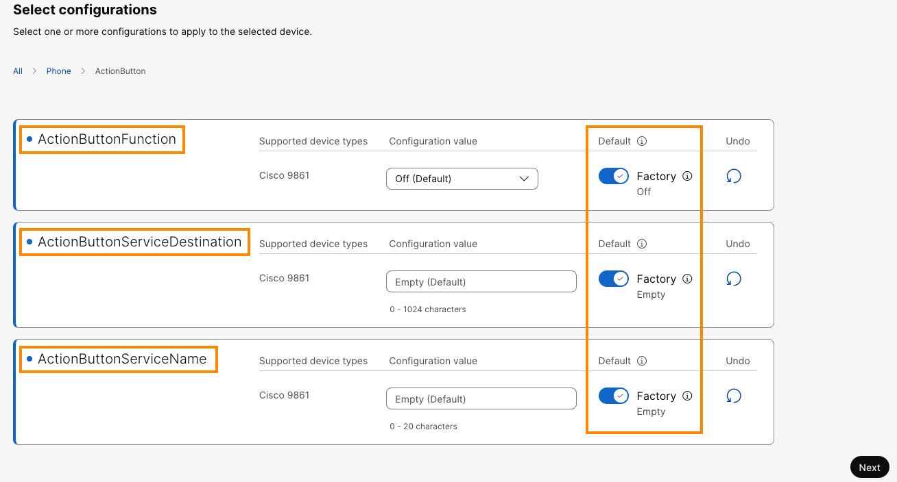
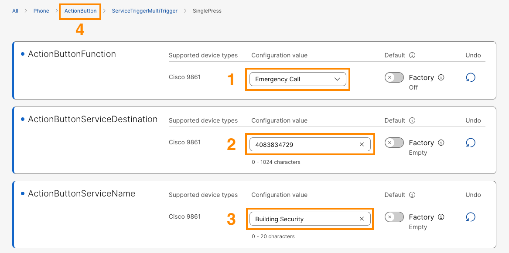
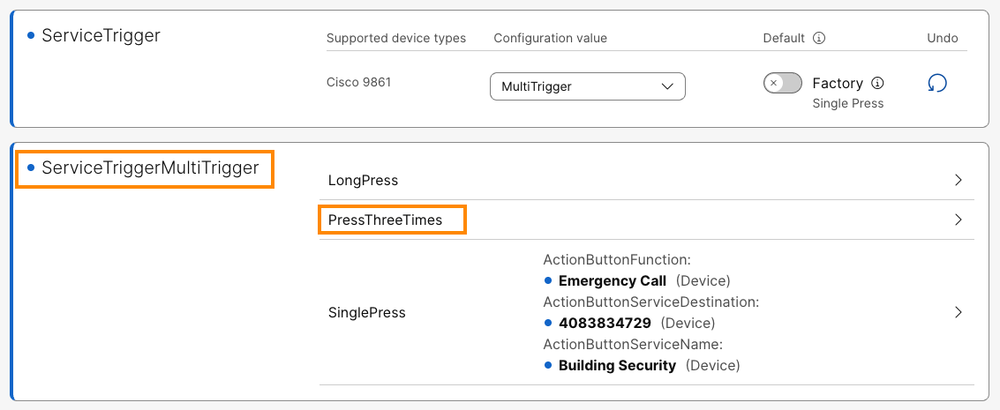
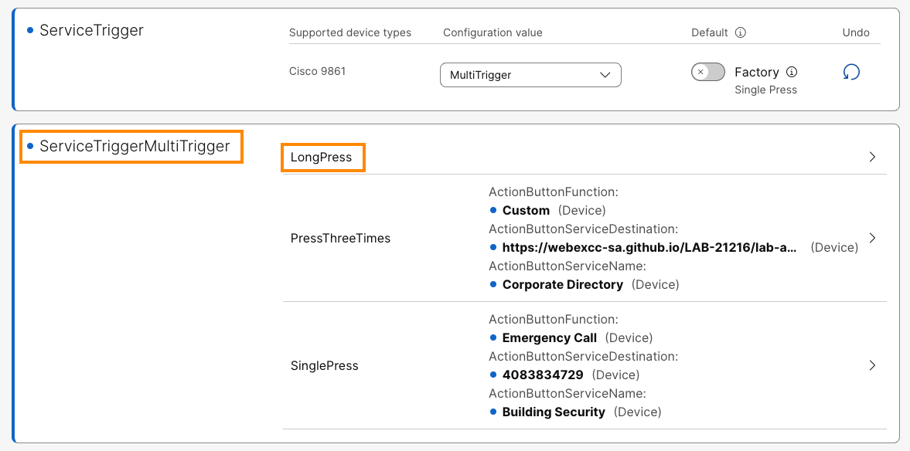

# Bonus Lab 2: Action Button Multiple Service Triggers

You can configure the Action button to connect to multiple services and assign each service with its own trigger. Like single press on action button places a call to a phone number & long press on action button displays evacuation map & three presses on action button would display corporate directory.

1. Continuing in the browser tab where you are logged in to Collaboration Control Hub, navigate to **MANAGEMENT > Devices.** It will list the phone you registered above. Select the **Cisco 98XX** device and on the device Overview page go to **Configuration** > **All configurations.**
2. Scroll down on the page, go to **Phone** > **Action Button.** Clear out (set all parameters to **Factory**) all Action Button parameters and click **Next**.

    

3. On the next page, it will list the changes that we are going make to the device. Click **Apply.** Click **Close**, on the next page.
4. On the device Overview page go back to **Configuration** > **All configurations.**
5. It will bring up **Device Configuration** page. Scroll down on the page, go back into **Phone** > **Action Button.**
6. Scroll down to see the option for **Service Trigger** and choose **MultiTrigger** from the dropdown.

    

7. Scroll down on the page, go to **Phone** > **Action Button > ServiceTriggerMultiTrigger > SinglePress.**

    

8. On the **SinglePress** configuration page, update the following values.
    1.  **Action Button Function** > **Cisco 98XX** > drop down the option and set **Emergency Call**
    2.  **Action Button Service Destination** > **Cisco 98XX >**  Enter the Smart Audio DID number <copy>**<w class="SmartAudioDid">Enter the Smart Audio DID in <a href="../overview/#lab-access">Overview &gt; Lab Access</a></w>**</copy>.
    3. **Action Button Service Name > Cisco 98XX >** Enter <copy>**Building Security**</copy> or any other name of your choice.

        

9. Scroll up on the page and select **ActionButton** (hyperlink) to configure the rest of the triggers.
10. It will bring up **Device Configuration** page. Scroll down on the page, go to **Phone** > **Action Button > ServiceTriggerMultiTrigger > PressThreeTimes.**

    

11. On the **PressThreeTimes** configuration page, update the following values.
    1.  **Action Button Function** > **Cisco 98XX** > drop down the option and set **Custom**
    2.  **Action Button Service Destination** > **Cisco 98XX >**  Enter below URL <copy><https://webexcc-sa.github.io/LAB-21216/lab-assets/cisco-phone-services/menu.xml></copy>
    3.  **Action Button Service Name > Cisco 98XX >** Enter <copy>**Corporate Directory**</copy>

        

12. Scroll up on the page and select **ActionButton** (hyperlink) to configure the rest of the triggers.
13. It will bring up **Device Configuration** page. Scroll down on the page, go to **Phone** > **Action Button > ServiceTriggerMultiTrigger > LongPress.**

    

14. On the **LongPress** configuration page, update the following values and click **Next**.
    1.  **Action Button Function** > **Cisco 98XX** > drop down the option and set **Custom**
    2.  **Action Button Service Destination** > **Cisco 98XX >**  Enter below URL <copy>**<https://webexcc-sa.github.io/LAB-21216/lab-assets/cisco-phone-services/tornado.xml>**</copy>
    3.  **Action Button Service Name > Cisco 98XX >** Enter <copy>**Evacuation Map**</copy>

        

15. On the next page, it will list the changes that we are going make to the device. Click **Apply.** Click **Close**, on the next page. It will take you to Device phone on Collaboration Control Hub.
16. Once the configuration is applied, observe that on Cisco 98XX phone, **Action button guide** pops up in blue. Press **Got it**.
17. Now go to the phone and press
    1.  **Single Press** > It should place call to the number you configured. Make sure call gets connected, then hangup the call after few seconds.
    2.  **Press Three Times** > It should display the Corporate Directory you configured.
    3.  **Long Press** > It should display the Evacuation Map.
