# Lab 1: Setup

The Desk Phone 9800 series run PhoneOS. PhoneOS is a single operating system for both CUCM and Cloud deployed Phones. All you have to do is to Factory reset the device to migrate from one to another. This eliminates the need for migrating the firmware on the device and eases the process of switching the device from CUCM to Webex Calling or to any other SIP based calling platforms. This also helps in retaining the user experience across the platforms.

In this module we will walk you through initial setup including a desk phone onboarding.

### **Module 1a: Logging into Collaboration Control Hub**

1. Click <a href="https://admin.webex.com" target="_blank">Collaboration Control Hub</a> link to open it in a new browser tab.
2. Login using following credentials:
    - Username / Email address: <copy><w class="ControlHubUsername"><a href="../overview/#lab-access">Go to Overview</a> section and enter your dCloud session details to auto populate this field</w></copy>
    - Password: <copy><w class="ControlHubPassword"><a href="../overview/#lab-access">Go to Overview</a> section and enter your dCloud session details to auto populate this field</w></copy>
3. For security reasons, **Collaboration Control Hub** signs out every 20 minutes (Idle timeout) by default. For this lab, let’s make the idle time out longer so the Control Hub does not sign you out often during this lab. Go to **MANAGEMENT > Organization Settings > Control Hub’s idle timeout.** Drop down the option for **Control Hub idle timeout** and select **12 hours** or **no timeout**. Click **Save**.

    

### **Module 1b: Setup Webex Calling Location and PSTN Numbers**

**Note:** If you are following this lab guide as part of a live proctored lab at Webex One 2026, you should skip this step and directly <a href="../lab-1-setup/#module-1d-adding-98xx-devices-to-users">go to Module 1.d - Adding 98XX devices to users</a>. This has been pre-setup for you so you can save some time and carry out more lab activities. Following information is included as reference only.

Lets setup Webex location PSTN connection type and order PSTN DID numbers for users/phones.

1. Continuing in the browser tab where you are logged in to Collaboration Control Hub, go to **SERVICES** > **PSTN & Routing**.
2. Click + **Add Numbers**.

    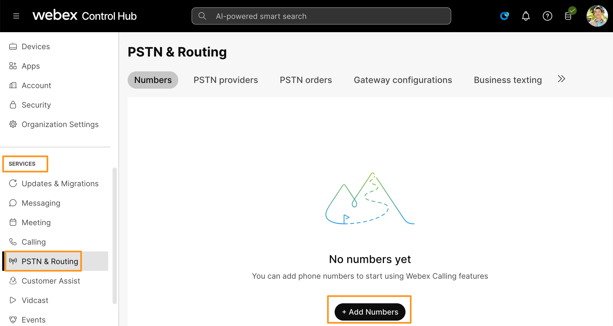

3. On the **Add Numbers** page, drop down the option for Location and choose **dCloud.** Since we are setting up this location for the first time, first we need to select the **PSTN Connection** for this location. Click **Edit** **PSTN**.

    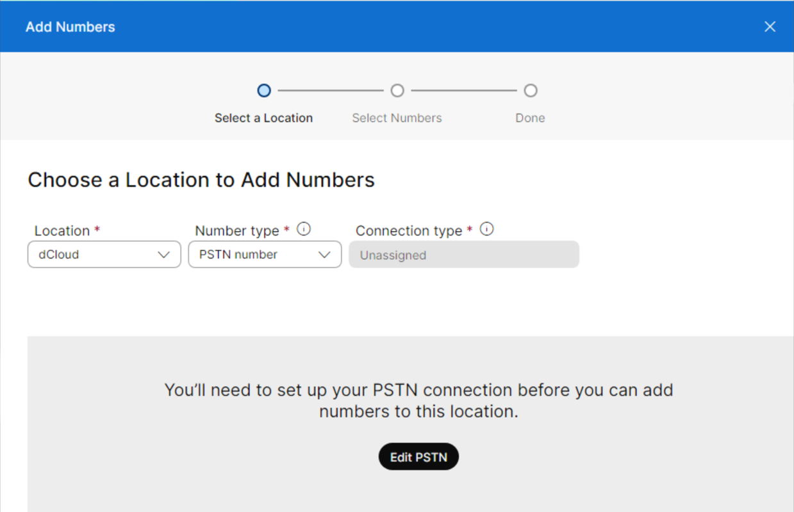

4. You will be taken to **Edit PSTN connection for dCloud** (Location) and under the connection type choose **Cisco Calling Plans** and click **Next**.

    **NOTE:** *If you do not see the option Cisco Calling Plans, close the page and repeat starting step 2.*

    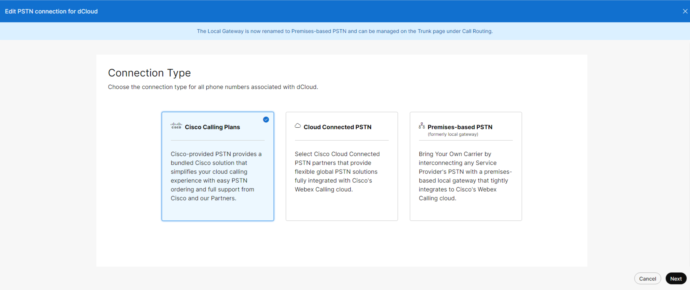

5. Enter the following information and leave rest of the fields blank and click **Next**.

    |  |  |
    | --- | --- |
    | ***Parameter*** | ***Value*** |
    | First Name | <copy>Charles</copy> |
    | Last Name | <copy>Holland</copy> |
    | Email Address and Confirm Email Address | <copy><w class="ControlHubUsername"><a href="../overview/#lab-access">Go to Overview</a> section and enter your dCloud session details to auto populate this field</w></copy> |

    **NOTE:** *Following is just an example. You need to use the email from the table above for the domain assigned to your session*.

    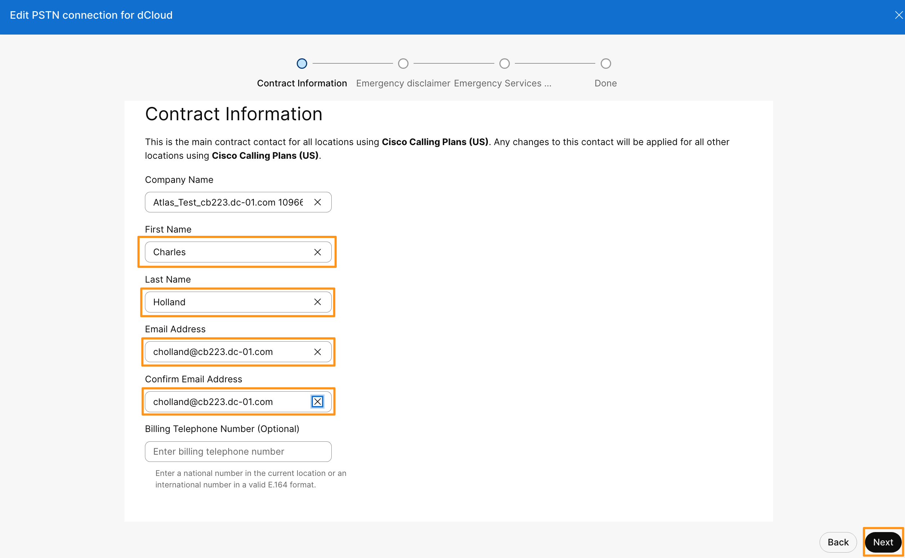

6. On the pop up window click **Yes, Change**.
7. Under the **Emergency disclaimer**, read and scroll the disclaimer information all the way down. Enter Authorized Contact as <copy>**Charles Holland**</copy> and title as <copy>**Engineer**</copy> and Click **Agree and Continue**.

    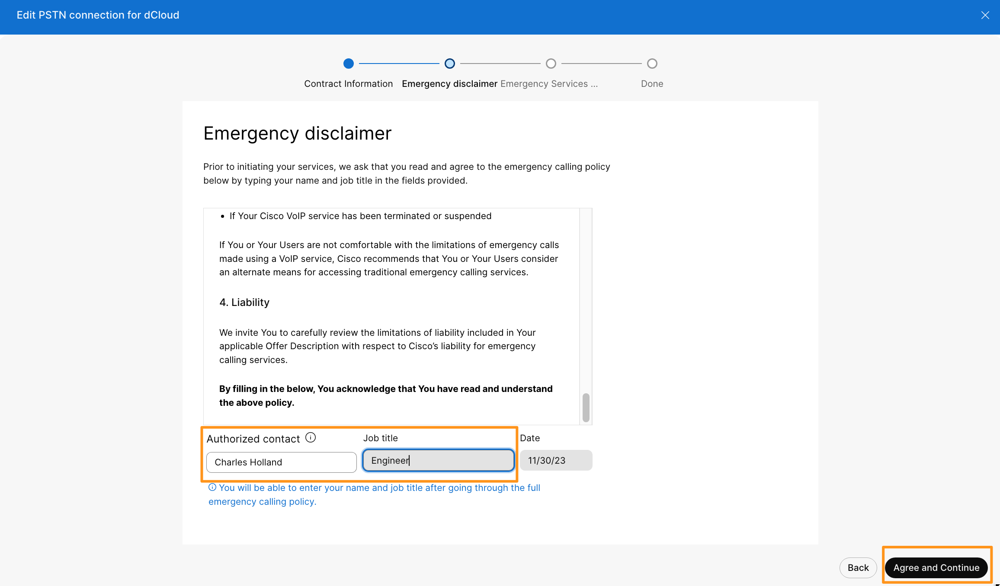

8. Under **Emergency Services Address**, leave everything default and click **Save**.
9. If promoted for **Suggested Address**, click **Apply**. Click **Save** again.
10. It will save all the information for PSTN connection we entered and take you summary page. On the following page, click **Add numbers.**

    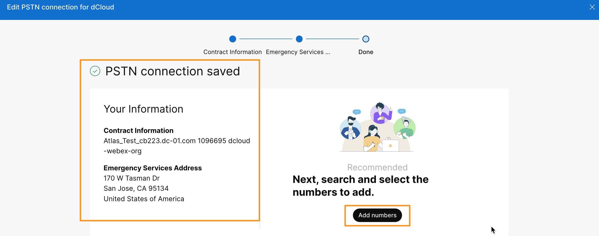

11. On the **Add Numbers** page, make sure location is selected as **dCloud** and the number type is selected as **PSTN number**. Keep the option **Order New Numbers** is selected and click **Next.**

    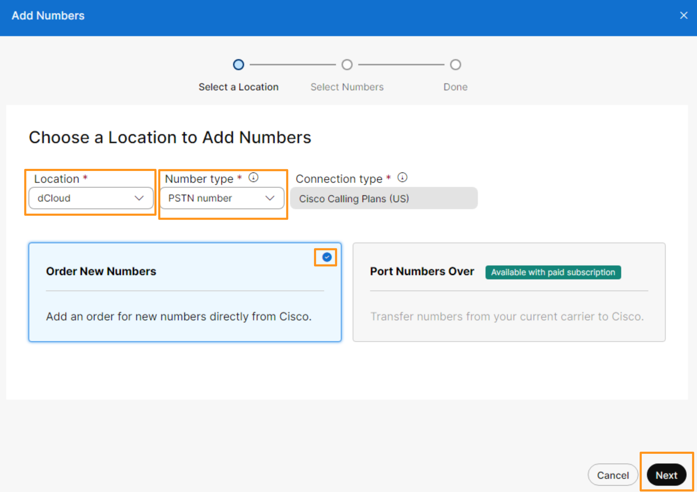

12. On the **Specify numbers you want to order** page, drop down the option for **State/Province/Region** and choose any of the available states in United States (In this lab we support Cisco PSTN **ONLY** for **United States**).
13. Keep the search by option as **Area Code** and drop down the option for **Area Code** and choose any of area code of your choice. For **How may numbers do you want auto-selected for you?** Enter **4** and click **Search.**

    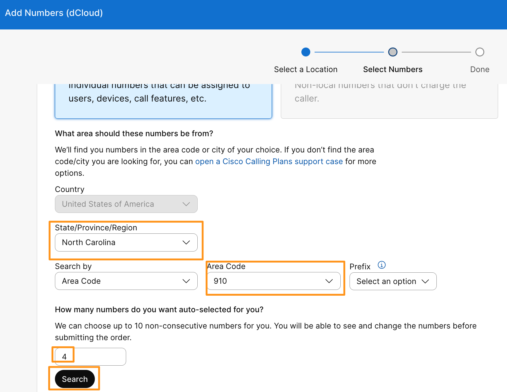

14. On the next page, it will show you list of available number in that area code that you specified above. It will auto select three numbers. If you like any specific number from list that is not auto selected, you can unselect one of the auto selected number and select that number you like. For now, just keep the auto selected numbers as is and click **Order**.
15. Order will be submitted for these numbers. On the following page, click **View orders**. The status will read **Pending** then change to **Provisioned** in few seconds. You may need to refresh the page to see the correct/accurate state or select the order number.
16. Click on the **Order** you placed (**Order ID**) > **Phone Numbers** to verify all phone numbers are provisioned.
17. Let's assign one of the phone numbers to location (dCloud) as Main number. Navigate to **MANAGEMENT** > **Location**. Select location **dCloud.** On the dCloud location page go to **PSTN** tab. Drop down option for **PSTN Configuration** > **Main Number** and choose one of the number we ordered above. Click **Save**.

    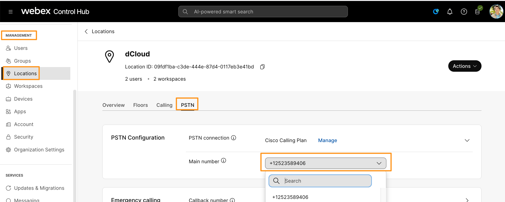

### **Module 1c: Assigning Webex Calling Licenses and PSTN Numbers to users in Webex Calling**

**Note:** If you are following this lab guide as part of a live proctored lab at Webex One 2026, you should skip this step and directly <a href="../lab-1-setup/#module-1d-adding-98xx-devices-to-users">go to Module 1.d - Adding 98XX devices to users</a>. This has been pre-setup for you so you can save some time and carry out more lab activities. Following information is included as reference only.

Use the following Control Hub steps to assign Webex Calling licenses, PSTN
numbers, extensions, and outbound calling access to both users.

1. Continuing in the browser tab where you are logged in to Collaboration Control Hub, go to **MANAGEMENT** > **Users** and choose **Charles Holland** from the list**.**
2. Scroll down on the summary page, click **Edit Licenses**

    **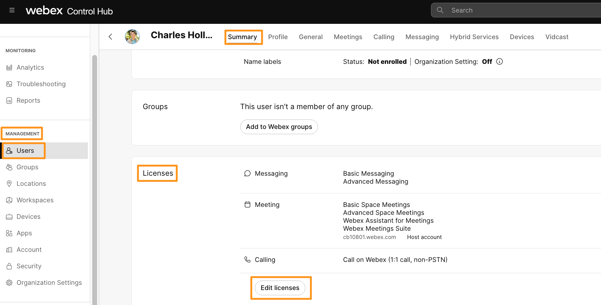**

3. On the **Edit services for cholland@cbXXX.dc-YY.com** page, click **Edit Licenses** again.
4. On the next page go to **Calling tab**. Check mark both options for **Webex Calling** and **Professional**. Click **Save**.

    **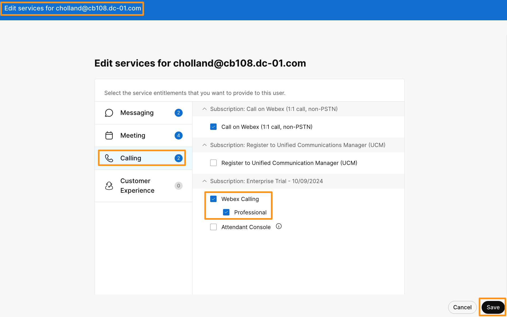**

5. On the next page, drop down the option for location and choose **dCloud** and drop down the option for **Phone Number** and choose one of the available numbers (that we ordered in above section). For **Extension** enter the last 4 digits of the number you chose for user. Click **Save**. Click **Close**.

    **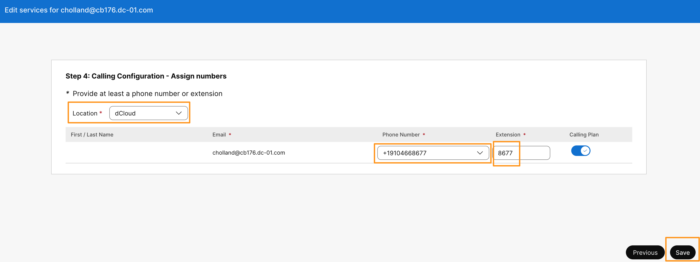**

6. Go back to **MANAGEMENT** > **Users** again and on users page choose **Anita Perez** and repeat steps 2 through 7, assign the Webex Calling license and DID number, and enable the Cisco Calling Plan.

### **Module 1d: Adding 98XX devices to users**

Cisco 9800 phones come with  built-in Near-Field Communication (NFC) feature used primarily for streamlined device provisioning and management. It allows for rapid out-of-box (OOB) setup by scanning an NFC tag with a mobile device.

UnifiedFX developed an application, called **DeviceFX NFC App,** that can be used to provision Cisco 9800 devices using NFC. Continue with the steps below (**Module 1d.1**) to provision the desk phone using this app. If you would like to provision the phones manually via Collaboration Control Hub, skip the below steps and go to **Module 1d.2** directly.

### **Module 1d.1: Adding 98XX devices to users using DeviceFX NFC App**

Use the workflow below to generate a Webex activation code and transfer it to a Cisco Desk Phone 9800 Series device with the **DeviceFX NFC App**.

1. Verify that the desk phone is on activation code screen and it claims NFC is supported.

    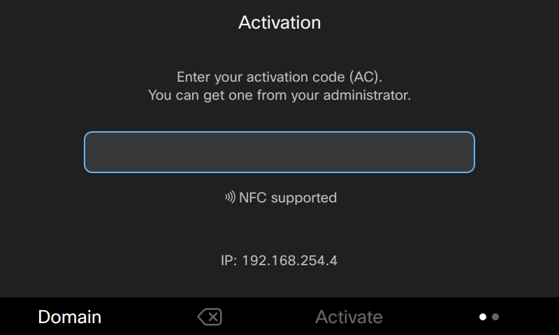

2. Install the DeviceFX NFC App from the Google Play Store or Apple App Store. For more information, visit [DeviceFX NFC](https://nfc.devicefx.com/){ target="_blank" rel="noopener noreferrer" }.

3. If you saved your bearer token under **Lab > Overview > Lab Access**, it appears below. If not, navigate to <a href="../overview/#lab-access">Lab access setup</a>, follow the instructions there to save the bearer token, and then return here.

  
Use the bearer token from <strong>Lab &gt; Overview &gt; Lab Access</strong>, or enter it here.

  

    <label for="devicefx-token">Webex bearer token</label>
    

      <input id="devicefx-token" type="password" autocomplete="off" spellcheck="false" maxlength="8192" placeholder="Paste the bearer token" data-webex-token-input>
      <button type="button" class="lab-access-button lab-access-button-secondary" aria-pressed="false" data-webex-token-toggle>Show</button>
      <button type="button" class="lab-access-button lab-access-button-primary" data-webex-token-use>Save token</button>
    

    

  

4. With the bearer token saved, click **Load calling users**, select a calling user, and select **Desk Phone 9861**. **Charles Holland** is selected automatically when available. Click **Generate activation code**.

  <button id="devicefx-load-users" type="button" class="devicefx-button devicefx-button-primary">Load calling users</button>

  

    

      <label for="devicefx-person">Calling user</label>
      <select id="devicefx-person" disabled>
        <option value="">Load calling users first</option>
      </select>
    

    

      <label for="devicefx-model">Phone model</label>
      <select id="devicefx-model">
        <option value="Cisco 9871">Desk Phone 9871</option>
        <option value="Cisco 9861" selected>Desk Phone 9861</option>
      </select>
    

  

  <button id="devicefx-generate-code" type="button" class="devicefx-button devicefx-button-primary" disabled>Generate activation code</button>
  

5. Wait for confirmation that the DeviceFX QR code was generated.

<section id="devicefx-result" class="devicefx-result devicefx-activation-card lab-access-nested" aria-labelledby="devicefx-result-heading" hidden>
  <h4 id="devicefx-result-heading">DeviceFX QR code</h4>
  

  

  <button
    id="devicefx-show-code"
    type="button"
    class="devicefx-button devicefx-button-secondary"
    aria-expanded="false"
    aria-controls="devicefx-activation-details"
  >Show activation code</button>
  

    

      

        Activation code
        <code id="devicefx-activation-code"></code>
      

      <button id="devicefx-copy-code" type="button" class="devicefx-button devicefx-button-secondary">Copy code</button>
    

    

      

        DeviceFX onboarding URL
        
      

      <button id="devicefx-copy-url" type="button" class="devicefx-button devicefx-button-secondary">Copy URL</button>
    

  

</section>

6. Scan the displayed QR code with your mobile phone. The DeviceFX onboarding link opens the DeviceFX NFC App and supplies the activation code. Click on "Save" button.

    Note: If you do not see the activation code displayed like in the screenshot below, exit the app and scan the QR code again.

    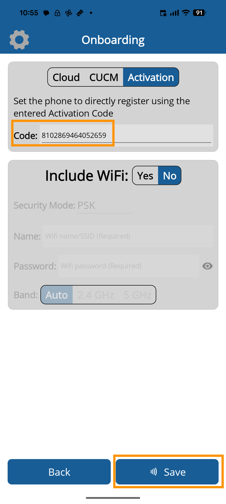{ width="326" height="1515" }

7. Follow the instructions in the app. When prompted, tap and hold the mobile phone over the desk phone's NFC area (right side of the navigation keys { width="32" height="34" }) until the activation code writing completes fully. Notice the app updates the status as it moves through various steps.

    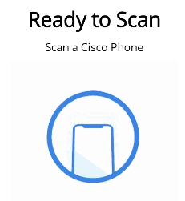{ style="border: 1px solid var(--md-default-fg-color--lighter);" }    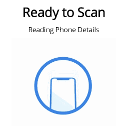{ style="border: 1px solid var(--md-default-fg-color--lighter);" }    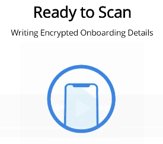{ width="287" height="253" style="border: 1px solid var(--md-default-fg-color--lighter);" }

8.  Desk phone will show the status as "Activating".

    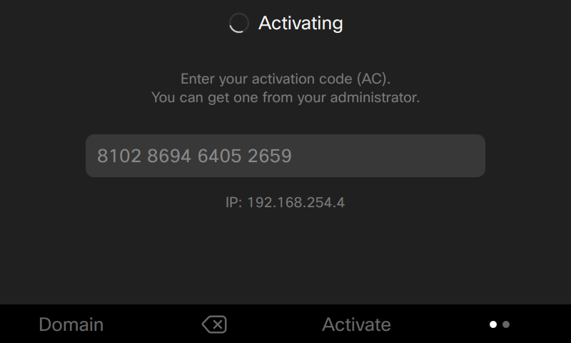

9.  Wait 2–3 minutes for the phone to register. In Webex Control Hub, navigate to **MANAGEMENT > Devices** and verify that the phone shows **Online**.

    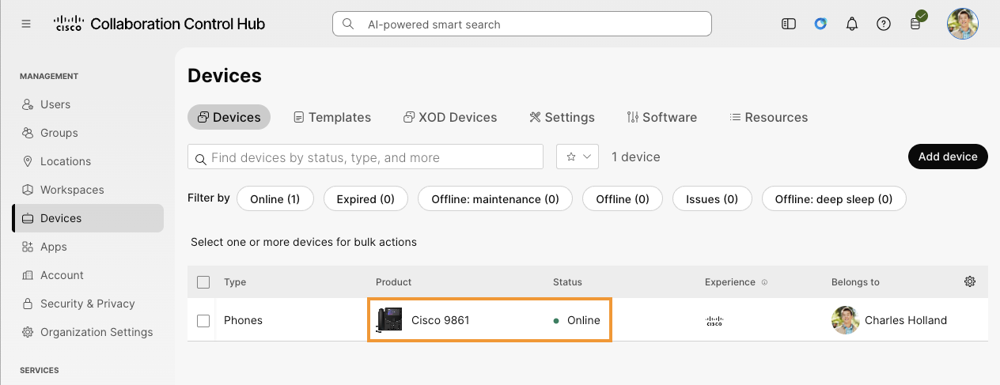

10. Click on the phone and you will get details about phone, like **MAC address**, **IP address**, **firmware** and **Software** channel etc.

    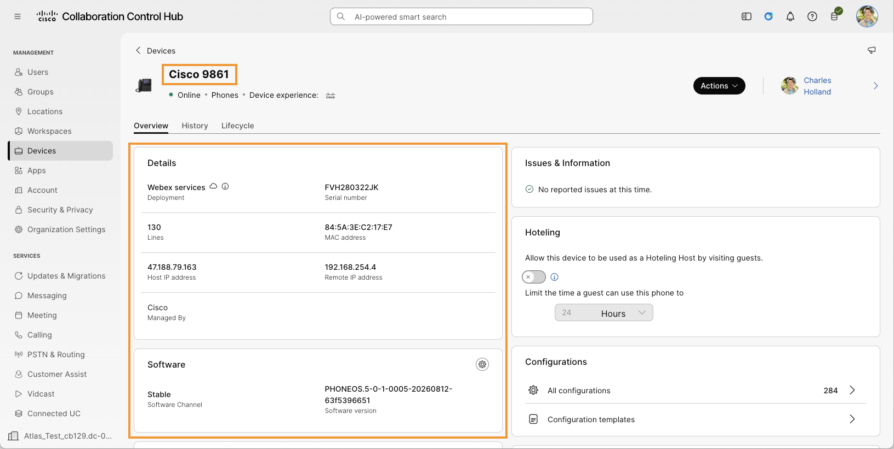

**NOTE:** The phone may upgrade its firmware and restart if a newer version is available from the Webex cloud.

### **Module 1d.2: Adding 98XX devices to users using Webex Control Hub**

**NOTE:** Only continue these steps if you skipped adding 98XX phone via NFC app in Module 1d.1.

1. Continue on the browser tab where you have Collaboration Control Hub logged in. Go back to **MANAGEMENT** > **Devices**. On the **Devices** page drop down **Add device** option and choose **Add device**.
2. In the **Add device** page, select **Add a device to a user** > **Next**

    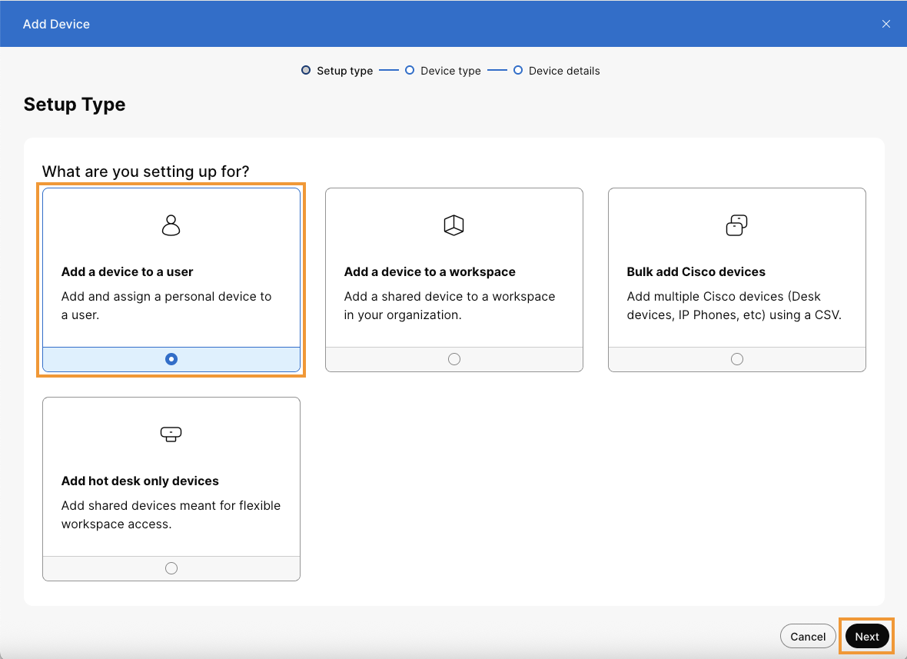

3. Next page of Add device workflow is to select the user. In the **User** text box, enter the name of the user **Charles Holland**. Note that, after you enter 3 characters of user, you will get drop down. Select the user **Charles Holland** and click on **Next.**

    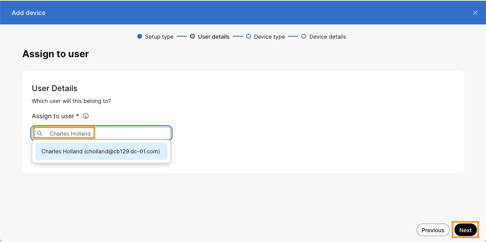

4. Next page of Add device workflow is to select the device type. In this page, notice the options and select **Cisco Desk Phone (Cisco Desk Phone 9800 series)**.

    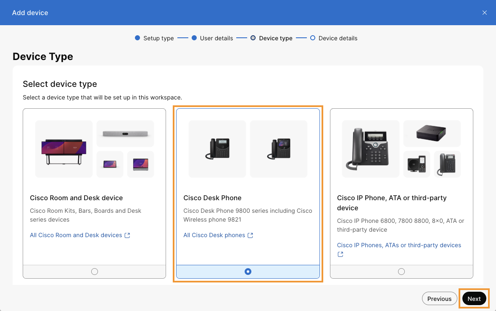

5. On the next page, drop down **Select device** option under **Select the device mode and activation method** and select your **Cisco 98XX** model. For the option **How would you like to setup this device?** select **By Activation Code** for this lab. Click **Next**.

    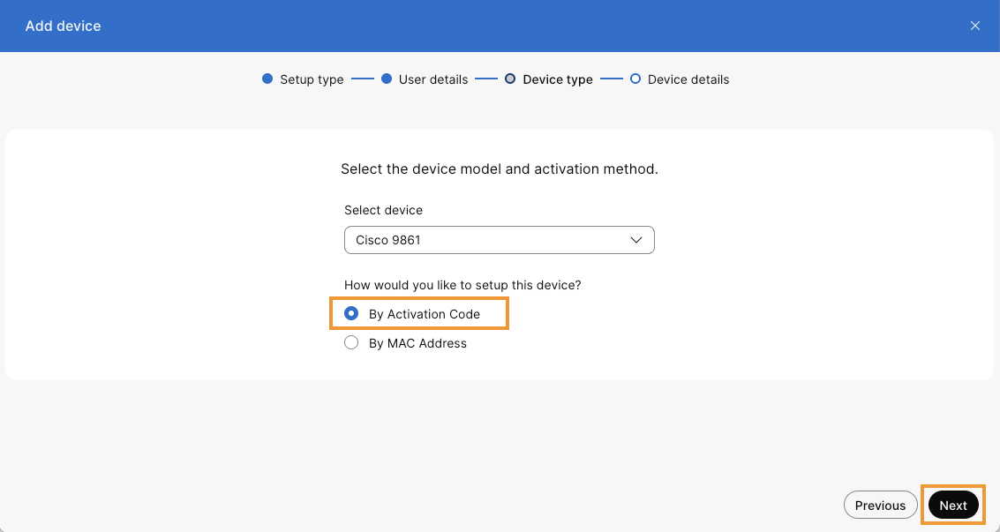

6. You will get an activation code to enter on the phone. Do NOT close this dialog yet.

    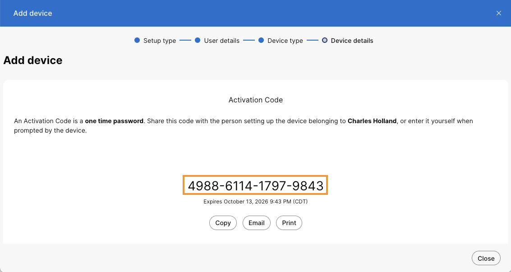

7. Enter the activation code on the phone and click Activate. Once the phone gives "Successfully activated" confirmation, you can close the activation code screen by clicking "Close" button.

8. It takes around 2 to 3 minutes for the phones to restart. After restart process completes, the phone will register to Webex.

9.  In the Collaboration Control Hub, navigate to **MANAGEMENT > Devices** and verify that the phone shows **Online**.

    

10. Click on the phone and you will get details about phone, like **MAC address**, **IP address**, **firmware** and **Software** channel etc.

    

<!--
9. Once you see both phones registered, place a test call between phones. Go to one of the Cisco 98XX phone (assigned to Anita or Charles), click the **Contacts** physical button. Type other user name **Anita (or Charles)** and you should see **Anita Perez (or Charles Holland)** displayed from the **Webex Directory**. Select **user** you searched for from the directory and press the softkey **Call** to place a call. Answer the call and verify that call gets connected.
-->
