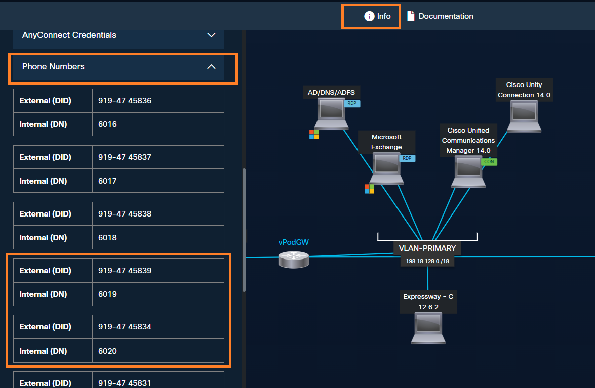

# Lab 10: Smart Audio in Webex Calling

Smart Audio features provide multiple ways to remove the noise from the phone microphone and from the remote caller’s side, providing the best experience for both the parties in the call.

For Cisco 98XX phones, in Smart Audio settings, you will have the options as follows:

***Microphone audio****:*

There are 3 options to enhance the audio coming from the phone microphone.

1. **Original:** Preserves all audio, including music and noise, with no processing. You may use if you want the other party to listen any specific sound that is created, such as music.
2. **Noise removal**: Removes all noise on the phone itself. This is very useful if you are in huddle room with multiple people attending the call on speaker but there may be noise coming from outside. This removes the noise created but everyone can be heard.
3. **Optimize for my voice**: Removes all noise and background voices. This is very useful if you are in an open office environment and you are attending a call. Phone can optimize the voice coming from the phone microphone ignoring other noise and voices captured by the microphone.

***Incoming audio (only 9861 and 9871)****:*

There are 2 options to enhance the incoming audio, particularly when you hear noise.

1. **Original**: Preserves all audio, including music and noise, with no processing. You may use if you want the to listen to any specific background sound that is coming from the other party in the call.
2. **Optimize for voice**: Removes all noise and enhances low-fidelity audio to high-definition. You may use if you want to remove any background noise such as wind, music, voices and increase the quality of the sound to Hi-Def.

Below steps are documented for Cisco 9871 and Cisco 9861, these steps might differ for other models.

In this lab, experience the **Optimize for voice** in **incoming audio**.

1. On the Cisco 9861 phone navigate to **Go to Settings** (Gear icon) > **User preferences** > **Audio** > **Smart Audio**
    1. Here, observe the two sections – 1) **Microphone audio** and 2) **Incoming audio**.
2. Scroll down and select **Incoming Audio** and then select **Original**. Click **Apply**.
3. Click **Settings (Gear icon)** again to exit settings menu.
4. Dial Smart Audio DID number <copy>**<w class="SmartAudioDid">Enter the Smart Audio DID in <a href="../overview/#lab-access">Overview &gt; Lab Access</a></w>**</copy>. You can use the speed dial that you created in earlier step.
5. You will be connected to a pre-recorded message with background noise. You may want to switch to using handset and increase the volume so you can clearly hear the audio.
6. Notice the background noise sounds like an airport or crowded place.

    NOTE: This session-specific DID is populated from the value saved under **Overview > Lab Access**.

    

7. While still on the call, navigate back to **Settings** (Gear icon) > **User preferences** > **Audio** > **Smart Audio**
8. Scroll down and select **Incoming Audio** and then select **Optimize for voice**. Click **Apply**.

    Observe that the **background noise** is removed for **incoming audio** and you can hear better compared to the **Original** option.

9. Hang up the call.