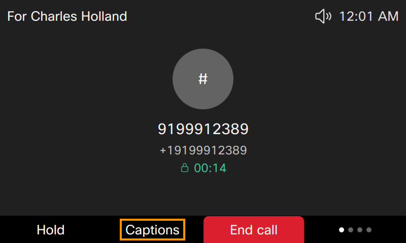
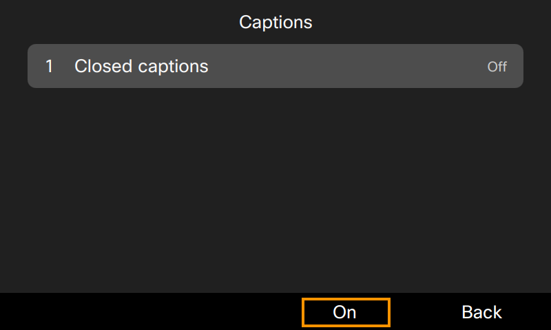
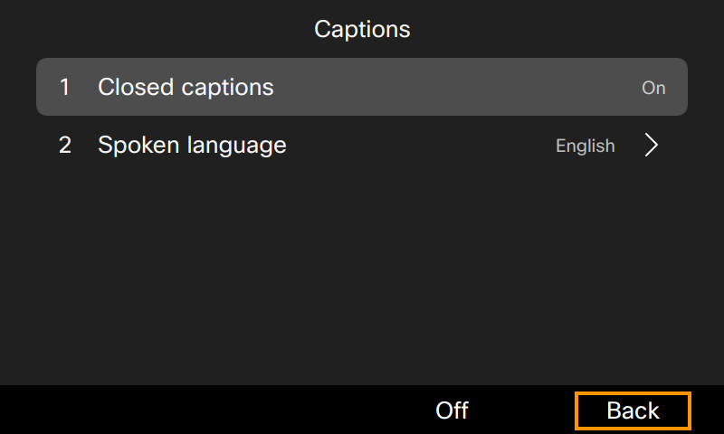
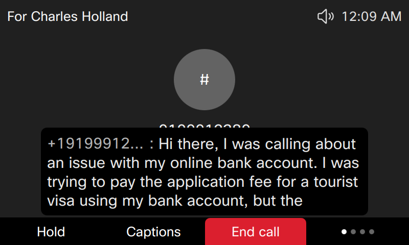

# Lab 11: Closed Captions

You can turn on and view closed captions real-time transcription on Cisco 98XX phone (9861 and 9871) during phone calls and Webex meetings.

As a participant in a phone call or a Webex meeting, you can choose to show or hide the real-time translation and transcription on the phone screen by simply pressing the softkey Captions or tapping the soft button Closed captions  (depending on your phone model).

When enabled, the closed captions will display just above the softkeys or soft buttons.

1. On the Cisco 9861 phone, dial Smart Audio DID number <copy>**<w class="SmartAudioDid">Enter the Smart Audio DID in Overview > Lab Access</w>**</copy>, associated with internal directory number 6019. You will be connected to a pre-recorded message.
2. Click on the "Captions" softkey.
    
    

3. Toggle the Captions ON.
   
    

4. Leave the Spoken language to default value of English. Click on "Back" softkey.
   
    

5. Now you will be able to see the captions on the phone screen.
   
    

   Up to 4 rows can be displayed in the closed captions on the phone screen.