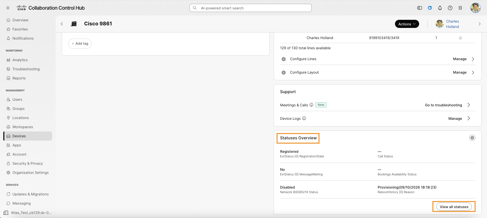
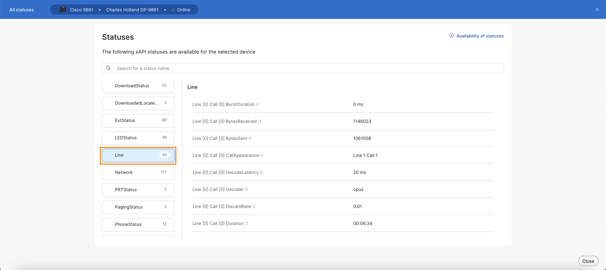

# Lab 12: View device statuses on Control Hub

You can search, list, and show status values from a specific device directly on Control Hub.

1. On the phone, use previously created speed dial to call Smart Audio DID number. Reduce the volume down to zero and let the call stay connected.

    

2. On the browser tab where you have Webex CH logged in. Navigate to **MANAGEMENT > Devices** on the left. It will list the Cisco 98XX phone registered.

3. Select **Cisco 98XX** from the list.

4. On the Device page, scroll all the way down to see the **Statuses Overview** panel. Click on **View all statuses**.

    

5. Scroll down in the left panel listing various statuses and select Line.

    

6. Notice various call statistics related to the active call.
