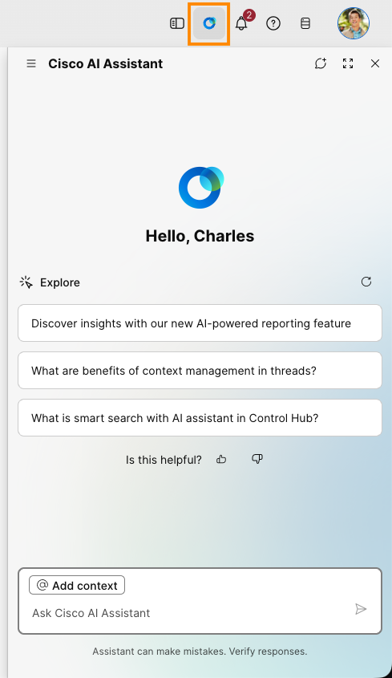
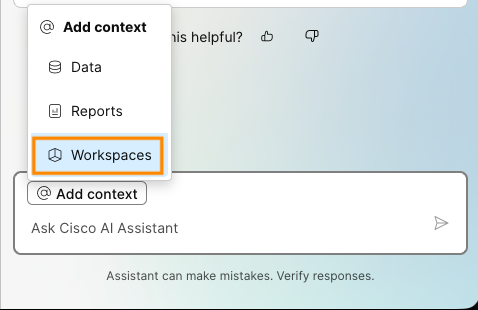
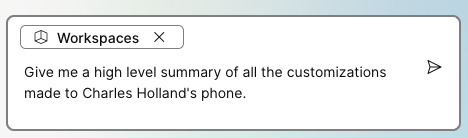
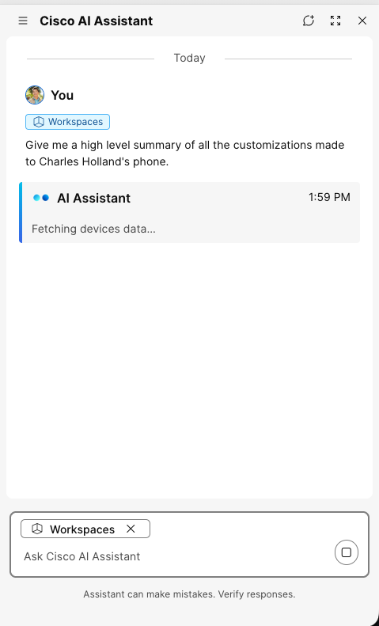
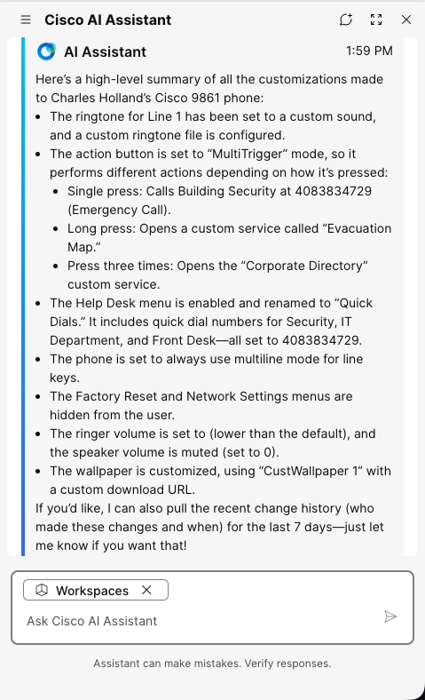
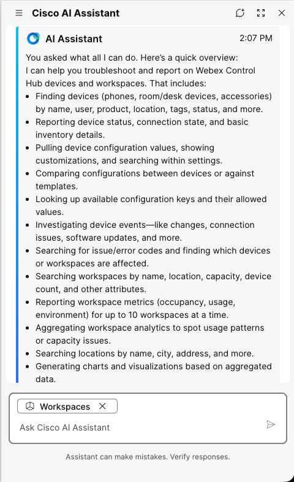

# Lab 13: Cisco AI Assistant

You can use Cisco AI assistant available in the Collaboration control hub to search and query data about your devices and get insights.

1. In the browser tab where you are logged in to Collaboration Control Hub, launch **Cisco AI assistant** from the top right corner.

    

2. Click on **@ Add context** button and choose **Workspaces** connector.

    

3. Enter a prompt like <copy>**Give me a high level summary of all the customizations made to Charles Holland's phone**</copy>.

    

4. Observe that AI assistant is working to get the data you requested.

    

5. Once it provides the response, review it to see the configurations changes you made for various lab activities summarized there. Please note that the exact response you get may differ from the example given below.

    

6. Find out more about **Workspaces** connector capabilities by asking <copy>**What all can you do?**</copy>. Please note that at the time of drafting this lab, it can not make any changes. It can only read, compare, and summarize. The exact response you get may differ from the example given below.
    

7. Close the Cisco AI Assistant side panel once done.

    