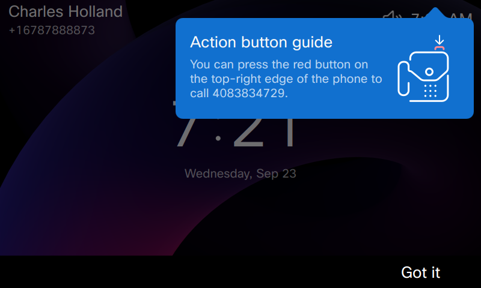
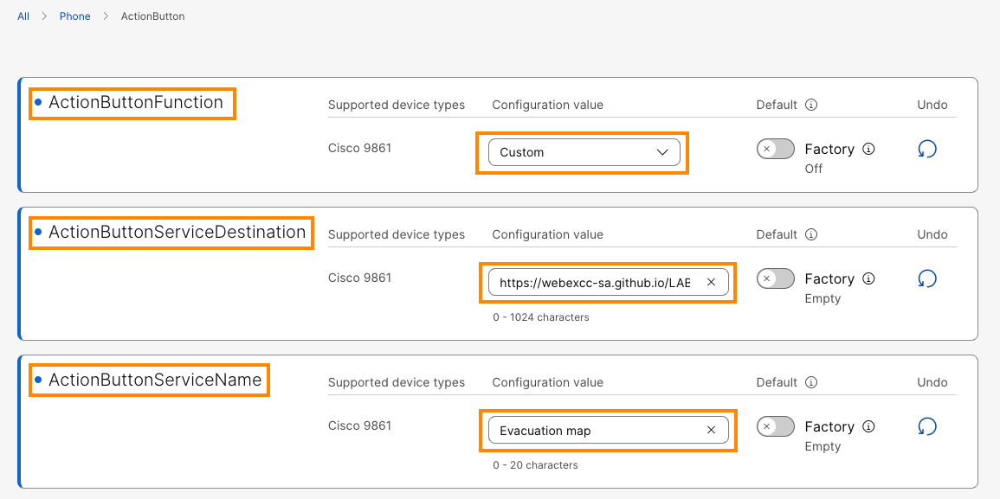
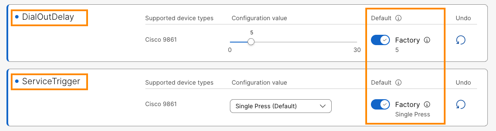
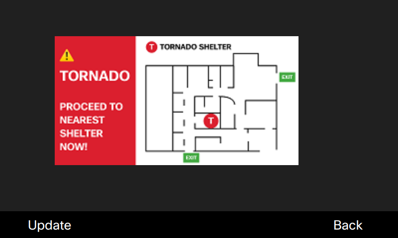
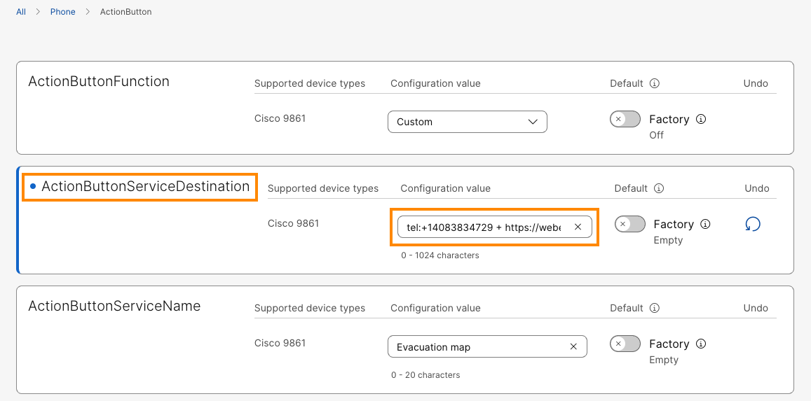

# Lab 2: Configure the Action Button Using Webex Calling

The Desk Phone 9800 Series is the first desk phone in the industry to have a red action button. The action button is a powerful way to provide new capabilities such as a dedicated emergency call button and silent emergency call button.

### **Module 2a: Configuring the Action Button as an Emergency call**

1. Continuing in the browser tab where you are logged in to Collaboration Control Hub, verify you are on the device overview page. If not, navigate to **MANAGEMENT > Devices.** It will list the phone you registered above. Select the **Cisco 98XX** phone from the list. 

2. On the device Overview page, go to **Configuration** > **All configurations.**

    

3. It will bring up **Device Configuration** page. Scroll down on the page, go to **Phone** > **Action Button.** On the Action Button configuration page, populate the following values and click **Next**.
    1. **Action Button Function** > **Cisco 98XX** > drop down the option and set **Emergency Call**
    2. **Action Button Service Destination** > **Cisco 98XX >**  Enter the Smart Audio DID number <copy>**<w class="SmartAudioDid">Enter the Smart Audio DID in <a href="../overview/#lab-access">Overview &gt; Lab Access</a></w>**</copy>.
    3. **Action Button Service Name > Cisco 98XX >** Enter any description (Like <copy>**Building Security**</copy>)

    

4. On the next page, it will list the changes that we are going make to the device. Click **Apply.** Click **Close**, on the next page.

    

5. Once the configuration is applied observe that on Cisco 98XX phone, **Action button guide** pops up in blue. Press **Got it**. This pop up will appear only once after any configuration changes to the Action button.

    { width="737" height="456" }

6. Click the **Action Button** (the red button on top of the device) on Cisco 9861, and observe that there is pop up in red “<**Service Name> Calling <The number you have configured> in 5 seconds**”. That 5 seconds will count down to 1 and the call will be placed. Call will be answered by automated system and will play pre-recorded message that is meant for smart audio demo.
7. You may reduce the speaker volume to very low to not disturb other lab attendees. You may Hang up the call after few seconds.

<!--

### **Module 2b: Configuring the Action Button as a Silent Emergency call**

1. Continuing in the browser tab where you are logged in to Collaboration Control Hub, navigate to **MANAGEMENT > Devices.** It will list both the phones you registered above. Select a different **Cisco 98XX** phone than you configured above (8a)**.** On the device Overview page go to **Configuration** > **All configurations.**
2. It will bring up **Device Configuration** page. Scroll down on the page, go to **Phone** > **Action Button.** On the Action Button configuration page, populate the following values and click **Next**.
    1. **Action Button Function** > **Cisco 98XX** > drop down and choose **Emergency Call**
    2. **Action Button Service Destination** > **Cisco 98XX >**  DID number assigned to **Anita Perez**.
    3. **Action Button Service Name >** anything descriptive (like Charles Holland)
    4. **Silent Emergency Call > Cisco 98XX >** drop down and choose **Enabled** (scroll down on the page to see the option)

3. On the next page, it will list the changes that we are going make to the device. Click **Apply.** Click **Close**, on the next page.
4. Once the configuration is applied observe that on Cisco 98XX phone, **Action button guide** pops up in blue. Press **Got it**.

5. Click the **Action Button** (the red button on top of the device) on Cisco 98XX, and observe that there is pop up in red “<**Service Name> Calling <The number you have configured> in 5 seconds**. **Screen will turn off, only the other party can end the call**”. That 5 seconds will count down to 1 and the call will be placed. Answer the call on other Cisco 98XX. Make sure the call gets connected.

Once the call is connected after 5 seconds, observe the following:

+ The screen goes dark.
+ No audio is heard. No dial tone. No ringtone.
+ Keypad, speaker, and mute are locked.
+ Remote party must hang up to end call.

6. Hang up the call (from the answered phone) after few seconds.

The purpose of this feature is to, help the caller in intruder alerts. Though the action button is pressed and the call is made, there is no visual notification of an active call on the device, instead device is acting as if it is idle.

### **Module 2c: Configuring the Silent Emergency call *Retrieval***

When you place a **Silent Emergency Call**, there could be some instances where the remote party not available or reachable and the caller may need to retrieve the call or the phone will be not usable until the current Silent Emergency call is some how disconnected. We can configure a new parameter (Silent Emergency Call Retrieval) to retrieve the call in those instances.

1. Continuing in the browser tab where you are logged in to Collaboration Control Hub, navigate to **MANAGEMENT > Devices.** It will list both the phones you registered above. Select the same device you configured Silent Emergency Call in above module.On the device Overview page go to **Configuration** > **All configurations.**
2. It will bring up **Device Configuration** page. Scroll down on the page, go to **Phone** > **Action Button.** On the Action Button configuration page, populate the following values and click **Next**.
3. **Allow Silent Emergency Call Retrieval >** drop down and choose **Yes**

4. On the next page, it will list the changes that we are going make to the device. Click **Apply.** Click **Close**, on the next page.
5. Once the configuration is applied observe that on Cisco 98XX phone, **Action button guide** pops up in blue. Press **Got it**.

6. Click the **Action Button** (the red button on top of the device) on Cisco 9871, and observe that there is pop up in red “<**Service Name> Calling <The number you have configured> in 5 seconds**. **Screen will turn off, Press any key to turn it back on**”. That 5 seconds will count down to 1 and the call will be placed. Answer the call on other Cisco 98XX. Make sure the call gets connected.
7. Now, while the call is active, press any key on the phone (where the call is placed from) and observe that you can get screen back on and all options (like mute, end call, etc.,) are available. You can also press volume button up (+ sign) and listen to remote party.

-->

### **Module 2b: Configuring the Action button with Dial Out Delay**

In the above steps, when you pressed **Action Button** on **Cisco 98XX** Phone you have observed that there is a pop up in red that appears for 5 seconds with a count down. You may wondering what if I want trigger be immediate OR I want longer timeout. That is a configurable parameter in Control Hub to anywhere from 0 to 30 seconds.

If the Dial Out Delay is set to 0, then there is no red pop and the device dials the configured number immediately.

If you want to try out Dial Out Delay:

- Continue on the browser tab where you are logged into the Collaboration Control Hub.
- Verify you are on Device overview page, if not, go to **MANAGEMENT** > **Devices**. Select the **Cisco 98XX** phone from the list.
- Go to **All Configurations** > **Phone** > **Action Button** > **Dial Out Delay**. Use the slider bar (0 through 30) to change the value to desired value.

    

- Click **Next**. Click **Apply**, on next page. Click **Close**, on next page.
- Once the configuration is applied, observe that on selected Cisco 98XX device **Action button guide** pops up in blue. Press **Got it**.
- Press the action button on the phone and make sure that the configured **Dial Out Delay** works.
- Hangup the call after few seconds.

### **Module 2c: Configuring the Action button Service Trigger**

In the above steps, when you pressed **Action Button** on **Cisco 98XX** Phone you have observed that pressing the **Action Button** once (Single Press called **Service** **Trigger**) would dial the destination you configured. This option (**Service** **Trigger**) is a configurable parameter in Control Hub to any of the following options.

1. Single Press (Default)
2. Long Press
3. Press 3 times

If you want to try out a different service trigger:

- Continue on the browser tab where you are logged into the Collaboration Control Hub.
- Verify you are on Device overview page, if not, go to **MANAGEMENT** > **Devices**. Select the **Cisco 98XX** phone from the list.
- Go to **All Configurations** > **Phone** > **Action Button** > **Service Trigger**.
- Drop down option for Cisco 98XX phone and choose desired option (either **Long Press** or **Press 3 times**) .

    

- Click **Next**. Click **Apply**, on next page. Click **Close**, on next page.
- Once the applied the configuration, observe that on selected Cisco 98XX device **Action button guide** pops up in blue. Press **Got it**.
- Press the action button (the way you configured either **Long Press** or **Press 3 times**), on the phone and make sure that it works. Hangup the call after few seconds.

Thus, you have options such as **Dial Out Delay** and **Service Trigger** configurations to avoid the accidental press of Action button to avoid unnecessary trigger of alerts.

### **Module 2d: Configuring the Action button for a *custom service***

You can customize action button for a specific needs to fit into your requirement. Like sending to an URL to display some office evacuation route / directory / custom message etc.,

1. Continuing in the browser tab where you are logged in to Collaboration Control Hub, verify you are on the device overview page. If not, navigate to **MANAGEMENT > Devices.** It will list the phone you registered above. Select your **Cisco 98XX** phone. 
2. On the device Overview page go to **Configuration** > **All configurations.**
3. It will bring up **Device Configuration** page. Scroll down on the page, go to **Phone** > **Action Button.** On the Action Button configuration page, populate the following values and click **Next**.
    1. **Action Button Function** > **Cisco 98XX** > drop down and choose **Custom**
    2. **Action Button Service Destination** > **Cisco 98XX >**  use the URL: **<copy><https://webexcc-sa.github.io/LAB-21216/lab-assets/cisco-phone-services/tornado.xml></copy>** (Tornado alert).
    3. **Action Button Service Name** > Enter **<copy>Evacuation map</copy>**
    4. Set the **Dial Out Delay** and **Service Trigger** configurations back to their default value by clicking on the Factory Default switch.

        

        

4. On the next page, it will list the changes that we are going make to the device. Click **Apply.** Click **Close**, on the next page.
5. Once the configuration is applied observe that on Cisco 98XX phone, **Action button guide** pops up in blue. Press **Got it**. This pop up will appear only once after any configuration changes to the Action button.
6. Click the **Action Button** (the red button on top of the device) on Cisco 98XX, and observe that there is pop up in red “**Sending** <**Service Name> in 5 seconds**”. That 5 seconds will count down to 1 and the evacuation map will be displayed as shown below.

    { width="530" height="341" }

7. Once verified, click **Back** softkey on the phone to go back to phone Home screen.

You can trigger multiple events with single trigger as well. Like when you press action button you want to both: Call a phone number (like emergency services) and also display the evacuation map on the phone.

7. Continuing in the browser tab where you are logged in to Collaboration Control Hub, verify you are on the device overview page. If not, navigate to **MANAGEMENT > Devices.** It will list the phone you registered above. Select your **Cisco 98XX** phone. 
8. On the device Overview page go to **Configuration** > **All configurations.**
9. It will bring up **Device Configuration** page. Scroll down on the page, go to **Phone** > **Action Button.** On the Action Button configuration page, update the following value and click **Next**. In this example we are using Evacuation map.
    1. **Action Button Service Destination** > **Cisco 98XX >**

    **<copy>tel:+1<w class="SmartAudioDid">Enter the Smart Audio DID in <a href="../overview/#lab-access">Overview &gt; Lab Access</a></w> + https://webexcc-sa.github.io/LAB-21216/lab-assets/cisco-phone-services/tornado.xml</copy>**

    (We are using Smart Audio external DID number in this example.)

    

    NOTE: Make sure you follow the format of **tel:+XXXXXXXXXX + URL** when you create your own destination (including the country code).

10. On the next page, it will list the changes that we are going make to the device. Click **Apply.** Click **Close**, on the next page.
11. Click the **Action Button** (the red button on top of the device) on Cisco 98XX, and observe that there is pop up in red “**Sending** <**Service Name> and calling <The number you have configured> in 5 seconds**”. That 5 seconds will count down to 1 and the call will be placed. Answer the call on your other Cisco 98XX phone. Make sure the call gets connected. Also observe that on caller phone it displays Evacuation map. Hang up the call after few seconds & click Back soft key on phone to go to phone Home screen.

    { width="558" height="365" }
