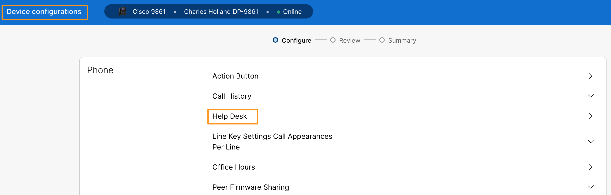
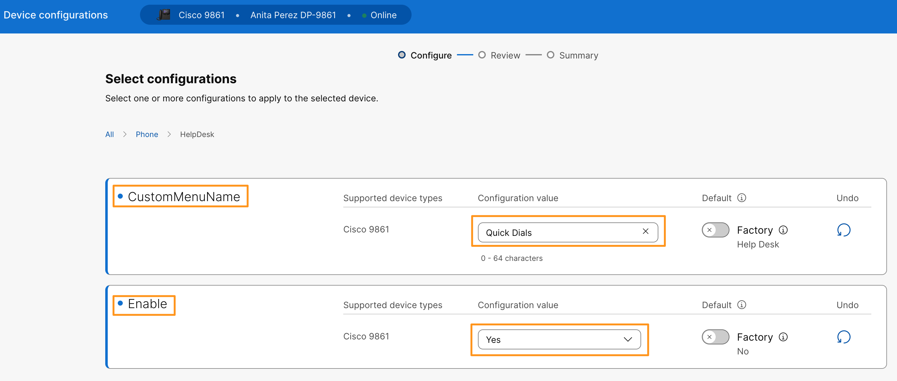
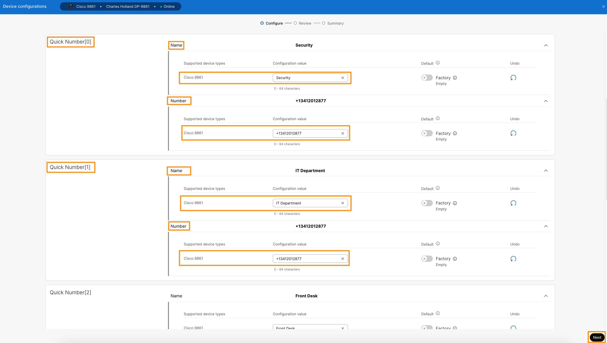
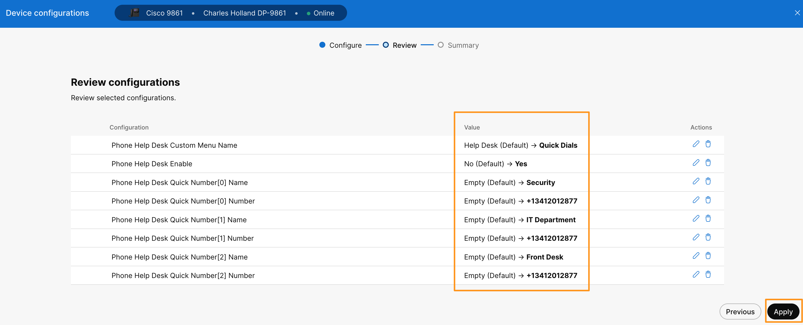

# Lab 3: Configure the Favorite Button on Webex Calling

The Desk Phone 9800 Series has a new Favorite Button. The Favorite Button can be used for voicemail, to quickly dial speed dials, or both. This module provides instructions on how to configure the Favorite Button to quickly dial up to 10 speed dials. The benefit to the end user is that it frees up the line keys on the main LCD screen real estate to be used for other purposes.

1. Continuing in the browser tab where you are logged in to Collaboration Control Hub, verify you are on the device overview page. If not, navigate to **MANAGEMENT > Devices.** It will list the phone you registered above. Select your **Cisco 98XX** phone.  
2. On the device Overview page, go to **Configuration** > **All configurations.** 
3. It will bring up **Device Configurations** page. Scroll down on the page, go to **Phone** > **Help Desk.**

    

4. Go to **Custom Menu Name > Cisco 98XX** and change it to <copy>**Quick Dials**</copy>. Expand the drop down options for **Enable > Cisco 98XX** and choose **Yes**.

    

5. Scroll down on the page to Quick Numbers section and set **Quick Number[0]**, **Quick Number[1]** and **Quick Number[2]** as follows:
    1. **Quick Number [0]** > Name > Cisco 98XX : <copy>**Security**</copy>
    2. **Quick Number [0]** > Number > Cisco 98XX : Smart Audio DID number <copy>**<w class="SmartAudioDid">Enter the Smart Audio DID in <a href="../overview/#lab-access">Overview &gt; Lab Access</a></w>**</copy>
    3. **Quick Number [1]** > Name > Cisco 98XX : <copy>**IT Department**</copy>
    4. **Quick Number [1]** > Number > Cisco 98XX : Smart Audio DID number <copy>**<w class="SmartAudioDid">Enter the Smart Audio DID in <a href="../overview/#lab-access">Overview &gt; Lab Access</a></w>**</copy>
    5. **Quick Number [2]** > Name > Cisco 98XX : <copy>**Front Desk**</copy>
    6. **Quick Number [2]** > Number > Cisco 98XX : Smart Audio DID number <copy>**<w class="SmartAudioDid">Enter the Smart Audio DID in <a href="../overview/#lab-access">Overview &gt; Lab Access</a></w>**</copy>

    

6. Click **Next**
7. On the next page, it will list the changes that we are going make to the device. Click **Apply.** Click **Close**, on the next page.

    

8. Once the configuration is applied, go to your **Cisco 98XX** phone for which you configured Favorite button and press the **Favorite** button (Star button { width="43" height="35" } ) and observe **Quick Dials** menu we configured above. Feel free to dial any of the options. Hang up the call after few seconds.
