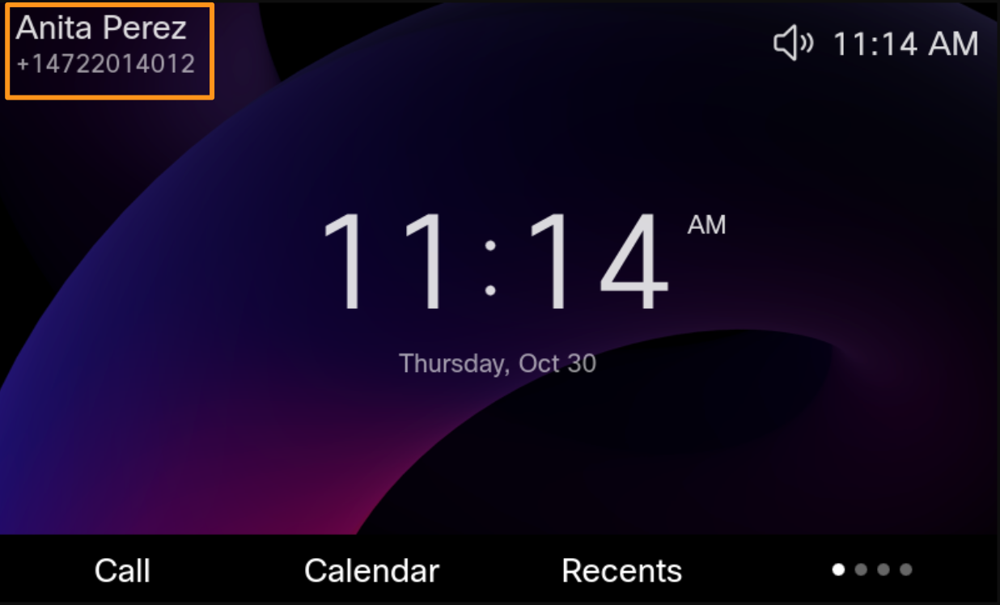
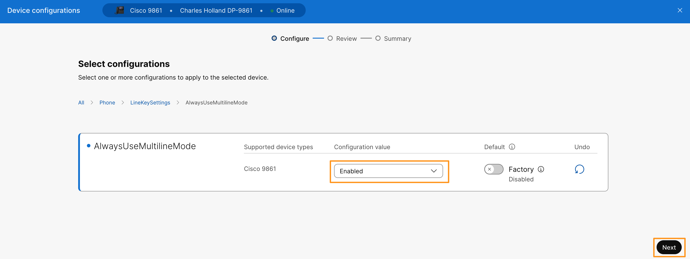
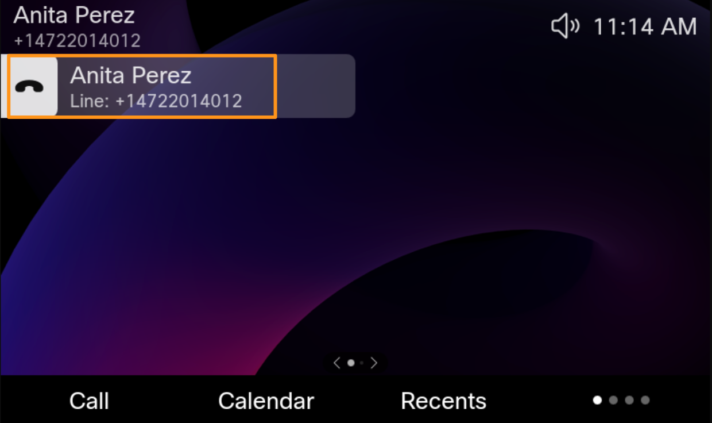

# Lab 4: Always use the multi-line layout

This feature is only available on Cisco Desk Phone **9841**, **9851**, and **9861**. It ensures a consistent user experience by forcing the phone to always display the multi-line layout.

By default, the phone displays the multi-line interface only when multiple lines or other line key features are configured. When Always Use Multi-line Mode is enabled, the phone uses the multi-line layout even if only a single line is configured.

Before we configure this feature let's observe current lines layout on your Cisco 9841/51/61 phone. It will have user name and phone number displayed on top left corner of the phone.

1. Before enabling Always use the multi-line layout observe phone screen and notice that only extension number or phone number is listed on top left corner.

1. On the browser tab where you have Webex CH logged in. Navigate to **MANAGEMENT > Devices.** It will list the phone you registered. Select your **Cisco 9841 or 9851 or 9861** phone**.** On the device Overview page, go to **Configuration** > **All configurations.**
2. It will bring up **Device Configurations** page. Search for key word **AlwaysUseMultilineMode.** Select **Phone** > **LineKeySettings** > **AlwaysUseMultilineMode** from the available options.
3. Drop down the option for **Cisco 98XX** phone and choose **Enabled** for **Configuration value** and click **Next**.

5. Click **Apply** on the next page. Click **Close** to close out **Device configurations** page.
6. Go to your Cisco 98XX device that you configured multi-line, observe the line layout it will user name and phone number on top left corner (like before) & it will display the same information on first line indicating only one line configured from available lines on the phone.

7. If you configure additional line it will list them right below line 1.
