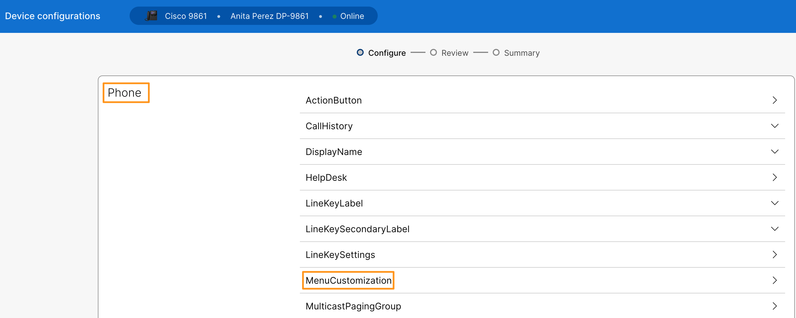
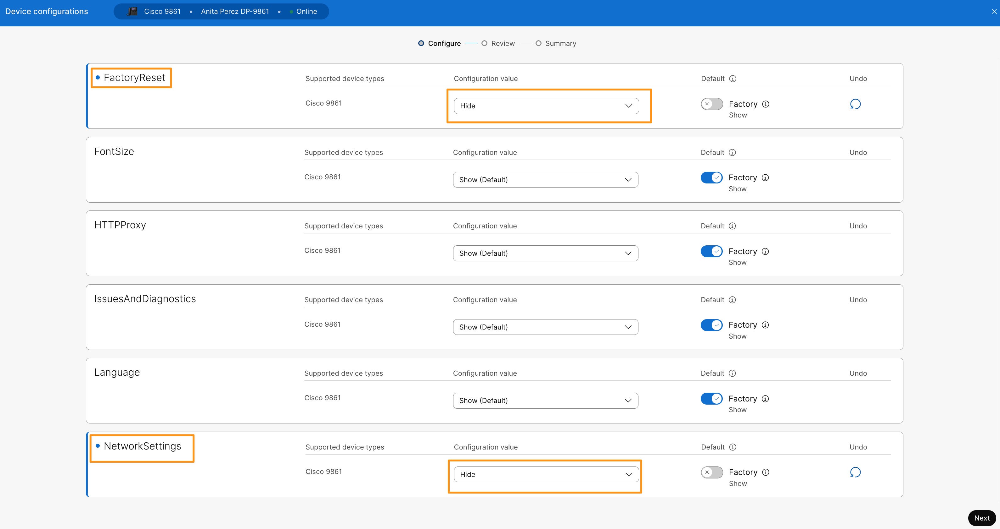
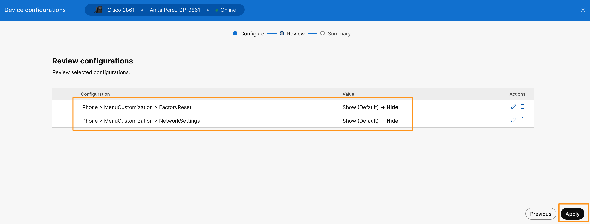
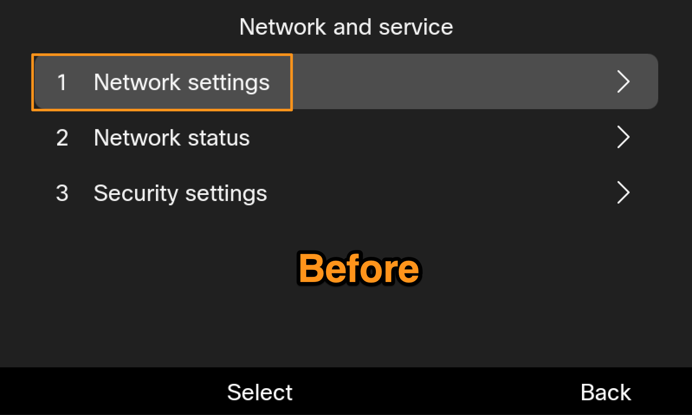
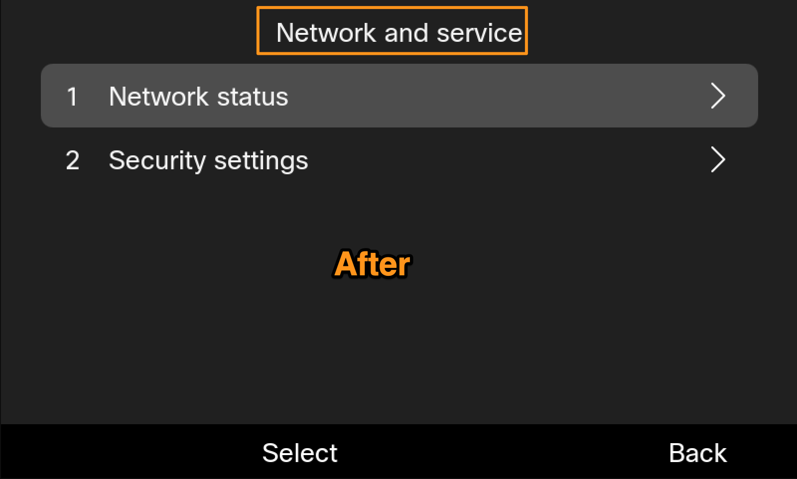
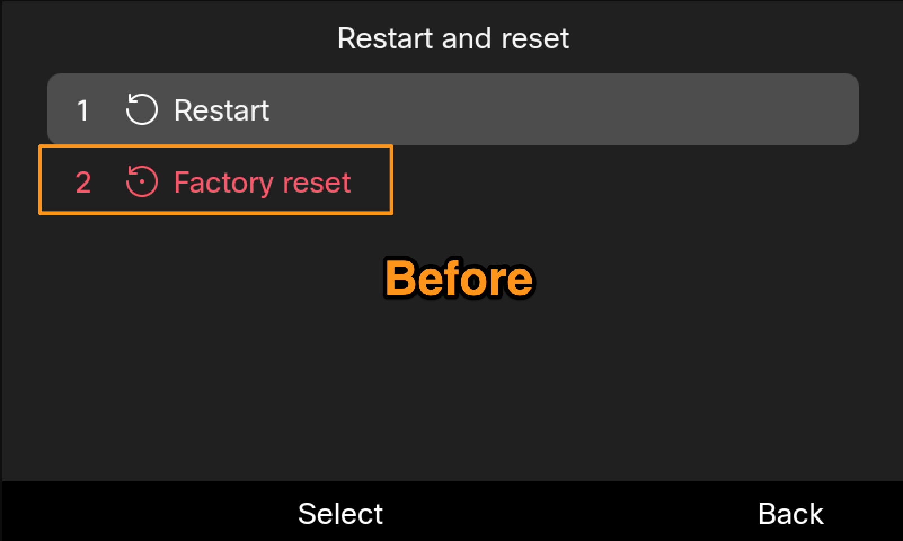
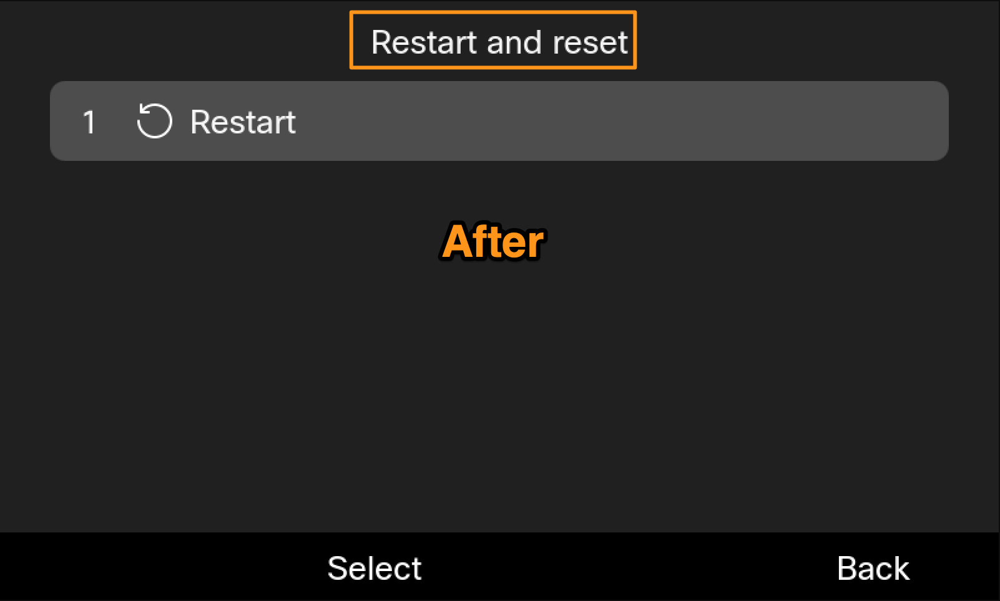

# Lab 5: Customize the Settings Menu

The menu customization feature allows administrators to enhance usability by displaying only relevant settings to users, and to improve control and security by restricting access to sensitive settings.

1. Before we customize the Setting Menu on phone, go to the phone and navigate to **Settings** > **Network and service** and verify that you **DO** see **Network Settings**. Then navigate to **Settings** > **Restart and reset** and verify you **DO** see **Factory Reset** option.

Now we will customize the Settings Menu to hide **Network Settings** and **Factory Reset** option.

2. On the browser tab where you have Webex CH logged in. Navigate to **MANAGEMENT > Devices.** It will list the phone you registered above. Select your **Cisco 98XX** phone**.** On the device Overview page go to **Configuration** > **All configurations.**
3. It will bring up **Device Configuration** page. Scroll down and go to **Phone** > **MenuCustomization**.

4. Under **MenuCustomization**, drop down option for any of the available options and choose to Hide it from **Phone Menu** options. In this example choose to hide options **FactoryReset** & **NetworkSettings**. Click **Next**.

5. On the next page it will list the parameters we selected to update. Click **Apply**. Click **Close**.

1. Now, go to the phone and navigate to **Settings** > **Network and service** and verify that you **DO NOT** see **Network Settings**. Then navigate to **Settings** > **Restart and reset** and verify you do not see **Factory Reset** option.

{ width="523" height="357" } { width="523" height="313" }

{ width="523" height="314" } { width="521" height="314" }

**NOTE**: The availability of menu items may vary by phone model. If all child items are hidden, the corresponding parent menu is also hidden.
