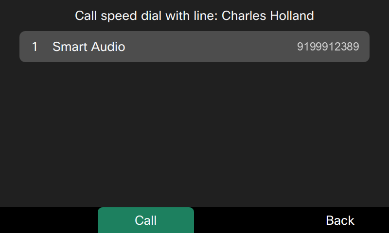

# Lab 5: User added speed dials

End user can add speed dials using Webex User hub and those show up on their desk phones.

1. Click [Webex User Hub](https://user.webex.com){ target="_blank" rel="noopener noreferrer" } link to open it in a new browser tab.

2. Login using following credentials:
    - Username / Email address: <copy><w class="ControlHubUsername"><a href="../overview/#lab-access">Go to Overview</a> section and enter your dCloud session details to auto populate this field</w></copy>
    - Password: <copy><w class="ControlHubPassword"><a href="../overview/#lab-access">Go to Overview</a> section and enter your dCloud session details to auto populate this field</w></copy>

3. Navigate to **Settings** -> **Calling** -> **Call settings** -> **Add speed dial**.

    

4. Select custom contacts option. Enter <copy>**Smart Audio**</copy> for the line key label and <copy>**<w class="SmartAudioDid">Enter the Smart Audio DID in <a href="../overview/#lab-access">Overview &gt; Lab Access</a></w>**</copy> (Smart Audio DID number) for the phone number. Click **Save**.

    

5. The newly added speed dial will show in the list.

    

6. When phone performs next resync to get the latest configurations, this speed dial will show up on the phone. For the purpose of this lab, continue with the following steps to update it immediately.

7. Continuing in the browser tab where you are logged in to Collaboration Control Hub, verify you are on the device overview page. If not, navigate to **MANAGEMENT > Devices.** It will list the phone you registered above. Select your **Cisco 98XX** phone.

8. On the device page, click on **Actions** -> **Apply changes**. Acknowledge the dialog popup and click on "Apply changes" button on the dialog.

    

9.  Phone may do a soft restart. Wait for a minute for it to reflect the changes and you will see the newly added speed dial assigned to a line key.

    

10. Feel free to dial the newly added speed dial by pressing the line key.

11. Press the down navigation key. Notice the same speed dial is also available in the list.

    
