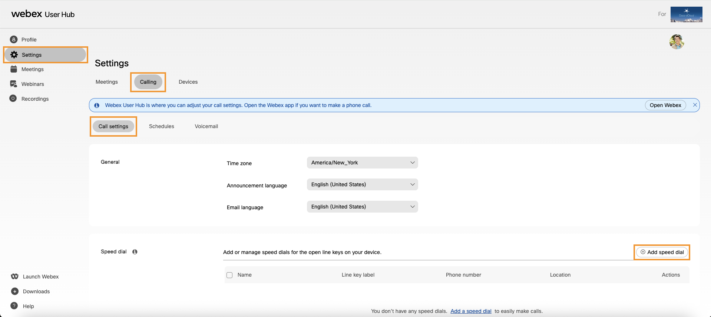
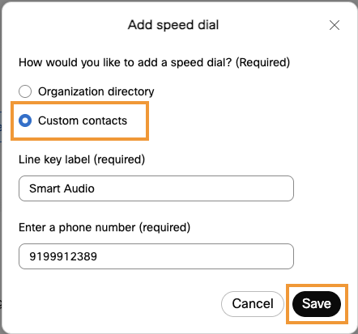
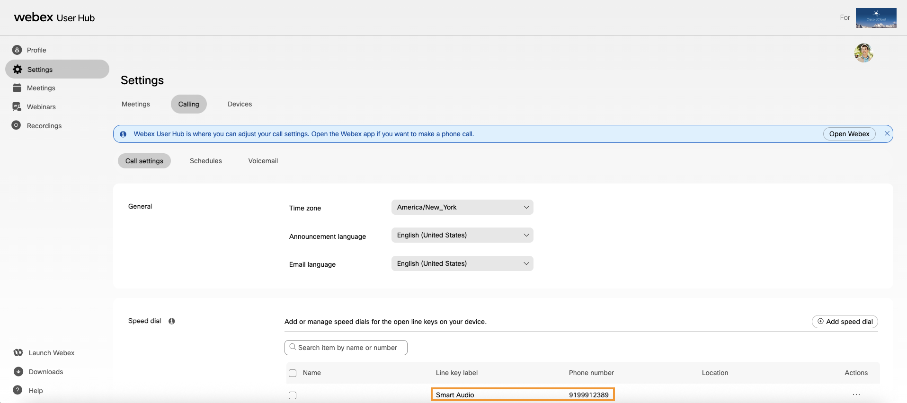
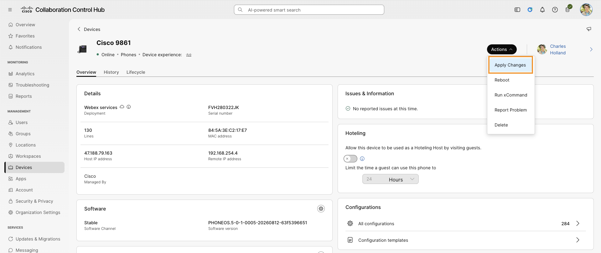
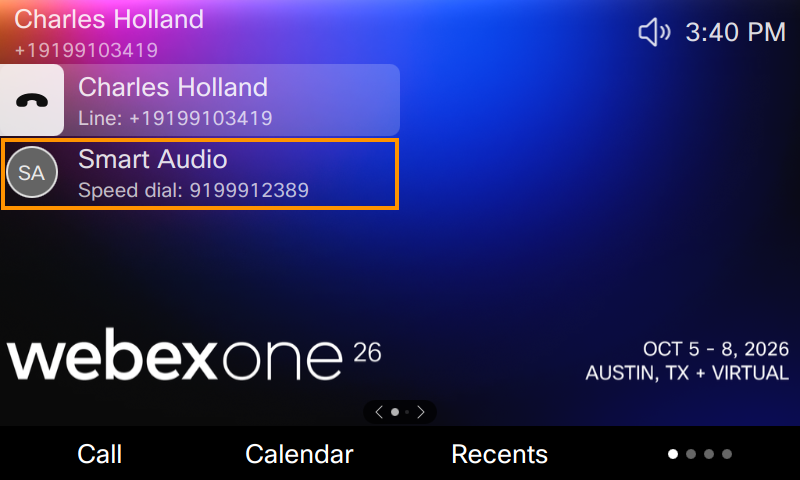

# Lab 5: User added speed dials

End user can add speed dials using Webex User hub and those show up on their desk phones.

1. Click [Webex User Hub](https://user.webex.com){ target="_blank" rel="noopener noreferrer" } link to open it in a new browser tab.

2. Login using following credentials:
    - Username / Email address: <copy><w class="ControlHubUsername">Go to Overview section and enter your dCloud session details to auto populate this field</w></copy>
    - Password: <copy><w class="ControlHubPassword">Go to Overview section and enter your dCloud session details to auto populate this field</w></copy>

3. Navigate to **Settings** -> **Call settings** -> **Calling** -> **Add speed dial**.

    

4. Select custom contacts option. Enter <copy>**Smart Audio**</copy> for the line key label and <copy>**<w class="SmartAudioDid">Enter the Smart Audio DID in Overview > Lab Access</w>**</copy> (Smart Audio DID number) for the phone number.

    

5. The newly added speed dial will show in the list.

    

6. On the browser tab where you have Webex CH logged in. Navigate to **MANAGEMENT > Devices** on the left. It will list the Cisco 98XX phone registered. Select **Cisco 98XX** from the list.

7. On the device page, click on **Actions** -> **Apply changes**. Acknowledge the dialog popup and click on "Apply changes" button on the dialog.

    

8.  Phone may do a soft restart. Wait for a minute for it to reflect the changes and you will see the newly added speed dial assigned to a line key.

    
