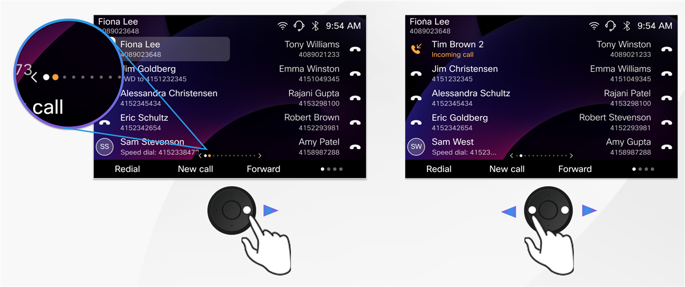

# Lab 7: Pagination on Cisco Desk Phone 9851 and 9861

Pagination allows you to navigate through multiple screens of extension lines, speed dials, and other configured features on line keys. This feature is only available on Cisco Desk Phone 9851 and 9861 registered to Webex Calling or Cisco BroadWorks.

**Overview**

Screen pagination increases the capacity of the phone. When your phone has more extensions or line key features than the number of the physical line keys, you can use the left and right keys on the Navigation Cluster to scroll through the screen pages.

Cisco Desk Phone 9851 supports up to 8 pages with a total of 46 lines, while 9861 supports up to 13 pages with 130 lines.

The available pages are represented as ellipsis at the bottom of the screen. A blinking orange dot indicates an incoming call alert on that specific page. A steady orange dot signals a BLF alert. Switching to that page clears the alert indicators.

To configure multiple lines, go back to browser tab on Workstation 1 wher you have logged into Webex Control Hub. Go to MANAGEMENT > Devices and select one of your 98XX devices (must be either 9851 or 9861). On the device page go to **Device Management** > **Configure Lines**. Add additional lines to explore the feature.
