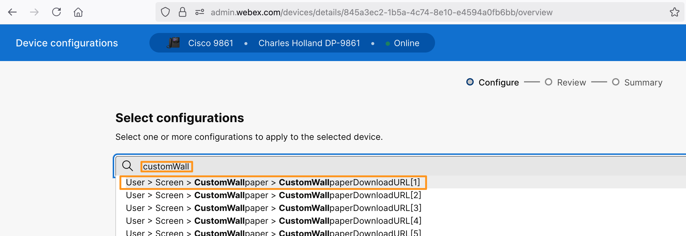
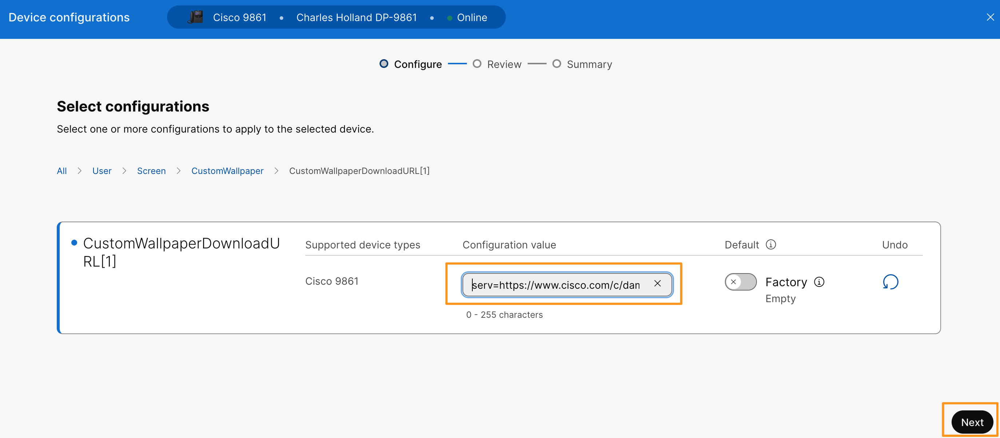
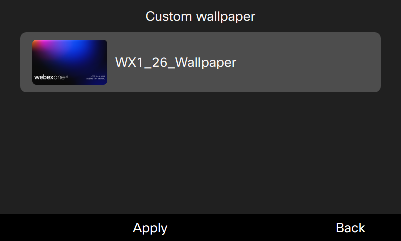
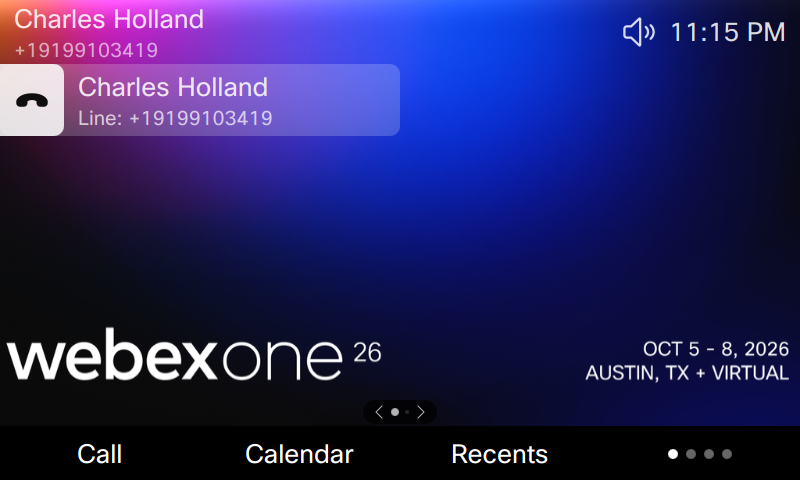

# Lab 8: Custom Wallpaper on Cisco 9800 Series Phones

The custom wallpaper feature allows you to customize and consistently display your brand identity across all corporate phones using personalized images and logos.

**Wallpaper and logo image requirements**

To get the best experience, keep the following tips in mind when choosing or designing your images:

* Avoid using clustered images that can make it hard for you to identify phone lines on the home screen. Simplicity is key when selecting wallpapers.
* Ensure that your chosen wallpapers match your phone's color scheme. Opt for wallpapers that complement either the dark or light color palettes. Dark images are best suited for dark mode, while light images work well for light mode.
* Avoid using high contrast images as wallpapers. The extreme contrast can make it challenging to see the logo and other screen elements against the background.
* Avoid using dynamic images as wallpapers.
* The logo displays on the phone screen only, and it doesn't display on the KEM screen. When multiple lines are configured on Cisco Desk Phone 9841, 9851, and 9861, the logo and the logo setting in the Settings menu are unavailable.
* To use custom wallpaper on phones with Key Expansion Modules (KEM) attached, prepare both phone wallpaper and KEM wallpaper.

For more information about wall paper/logo and resolution requirement visit the following URL: <https://help.webex.com/en-us/article/nq1xuwo/Custom-wallpaper-and-logo-for-9800/8875-(Control-Hub)#reference-template_d08f9f2c-36a0-4ef6-b069-e3bccdadae7f>

1. On the browser tab where you have Webex CH logged in. Navigate to **MANAGEMENT > Devices** on the left. It will list the Cisco 98XX phone registered.
2. Select **Cisco 98XX** from the list.
3. On the Device page go to **Configurations** > **All configurations**
4. On the Device configuration page search for key word **CustomWallpaper**. From the filtered list choose **User > Screen > CustomWallpaper > CustomWallpaperDownloadURL[1]**

5. On the Custom Wallpaper Download URL[1] page configure the following and click **Next**.

<copy>**serv**=https://webexcc-sa.github.io/LAB-21216/lab-assets/;**image**=WX1_26_Wallpaper.png;**thumbnail**=WX1_26_Thumbnail.png;theme=dark;</copy>

    1. serv = The URL address of where the wallpaper and thumbnail images are stored
    2. image = custom wallpaper name
    3. thumbnail = the custom wallpaper thumbnail

6. On the next page click **Apply**. Click **Close**.
7. Now go to the phone for which you have configured custom wall paper and navigate on the phone to **Settings** > **User preferences** > **Screen** > **Appearance** > **Custom wallpaper**, select the custom wallpaper and click **Apply**.

**NOTE**: The custom wallpaper location and image provided above are for demonstration purpose only. If you have your own custom wallpaper feel free to use them.
