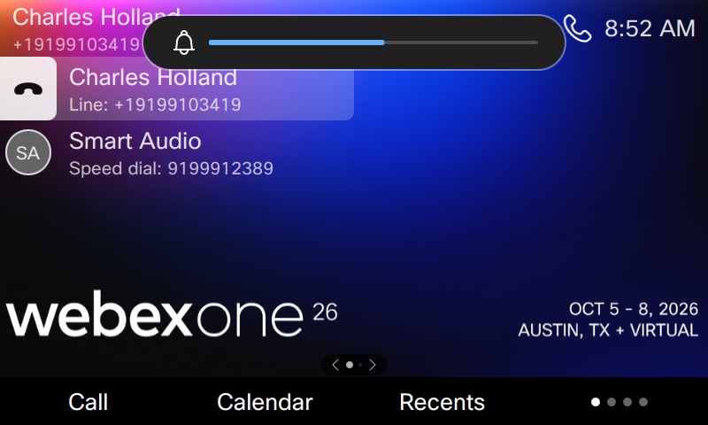
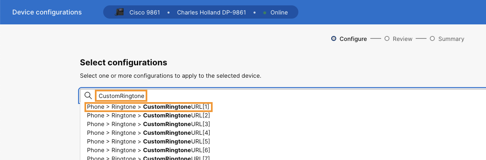
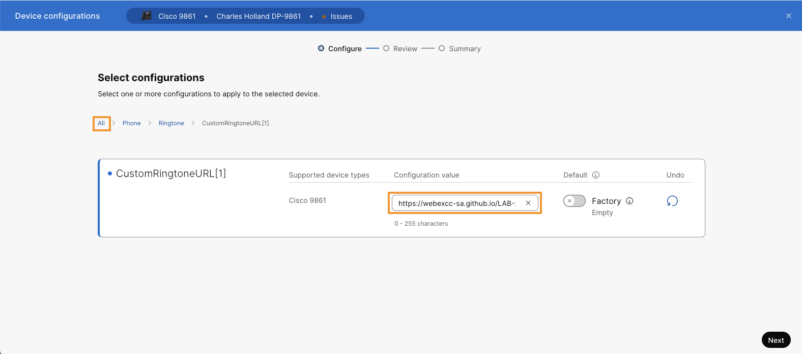
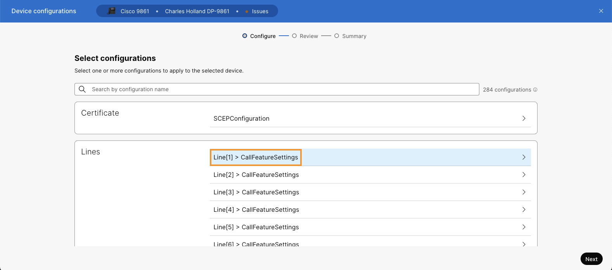
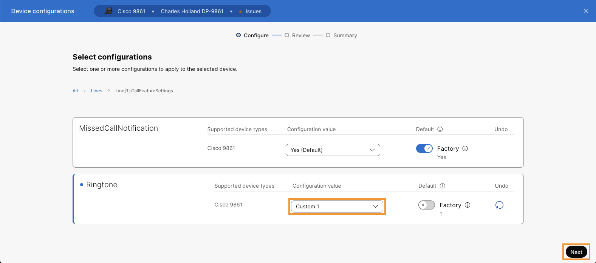
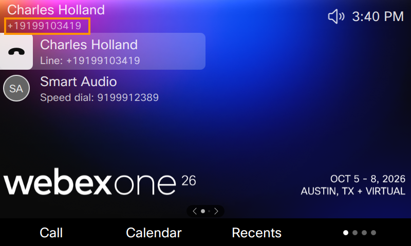

# Lab 9: Custom Ringtone

Ringtone settings let you manage how the phone alerts users to incoming calls. The phones provide built-in ringtones and support custom ringtones. Your phone supports up to 10 custom ringtones. When configured, users can assign them to individual lines on the phone.

Make sure your ringtone files meet these requirements:

- File format: .raw or .rwb
- Sampling rates: 8 kHZ(narrowband) or 16 kHZ(wideband)
- Maximum file size: 960 KB
- The phone must have network access to the server hosting the ringtone files.

For more information about custom ringtone, visit this resource link: [Configure ringtones for 9800 Series and 8875 phones (Control Hub)](https://help.webex.com/en-us/article/z6rlebb/Configure-ringtones-for-9800-Series-and-8875-phones-(Control-Hub)). For this lab, follow the instructions below:

1. First hear the current ringtone set on the desk phone. Hit the volume + button on the left side of the phone keypad to hear current ringtone. You will hear the phone playing current ringtone.

    

2. To install a custom ringtone, return to the browser tab where you are logged in to Collaboration Control Hub, then navigate to **MANAGEMENT > Devices** on the left. It will list the Cisco 98XX phone registered.
3. Select **Cisco 98XX** from the list.
4. On the Device page go to **Configurations** > **All configurations**
5. On the Device configuration page search for key word <copy>**CustomRingtone**</copy>. From the filtered list choose **Phone > Ringtone > CustomRingtoneURL[1]**

    

6. On the Custom Ringtone URL[1] page configure the following and click **All** in the configuration navigation menu.

    <copy>**[https://webexcc-sa.github.io/LAB-21216/lab-assets/cisco_synth4.raw](https://webexcc-sa.github.io/LAB-21216/lab-assets/cisco_synth4.raw)**</copy>

    

7. From All configurations screen, navigate to **Lines > Line[1] > CallFeatureSettings**

    

8. Set Ringtone to **Custom 1** and click **Next**.

    

9.  On the next page click **Apply**. Click **Close**.

10. Give phone few seconds to apply the changes.

11. Hit the volume + button on the left side of the phone keypad. Alternatively, you can also use your mobile phone to dial the DID number shown for Charles Holland on the top left corner of the phone screen.

    

12. Observe that phone plays Cisco Synth jingle as a ringtone.
