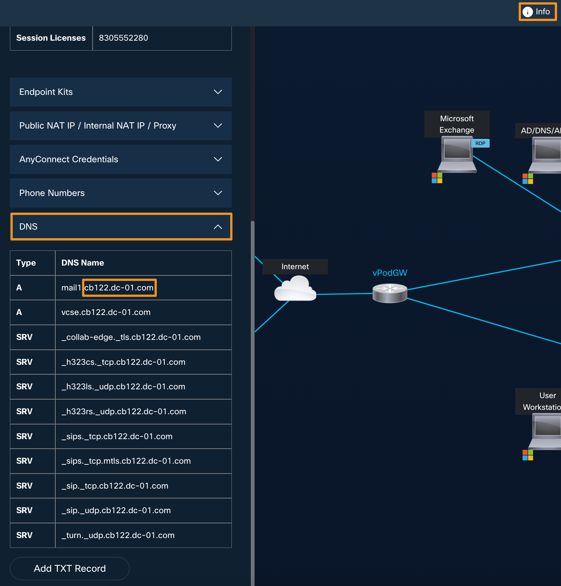
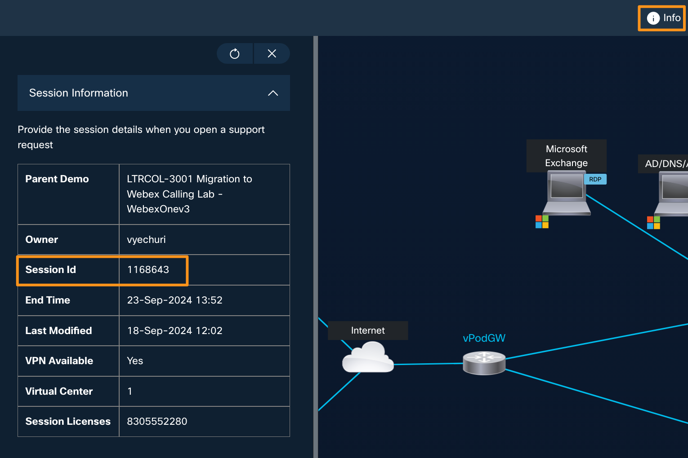
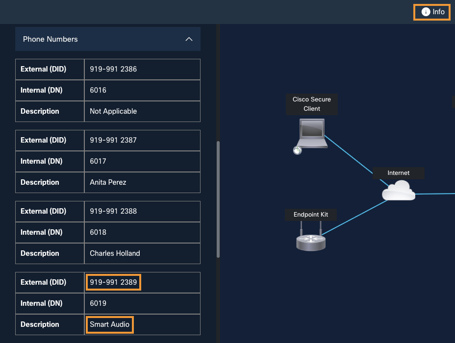

# Overview

## Learning Objectives

This lab will walk you through the setup, customization and management of the Cisco Desk Phone 9800 series when deployed with Webex Calling.

## Disclaimer

Although the lab design and configuration examples could be used as a reference, for design related questions please contact your representative at Cisco, or a Cisco partner.

## Lab Access

This lab uses your Cisco dCloud session details to populate the credentials you will use to access Collaboration Control Hub. These credentials will be populated automatically in the lab instructions so it is important that you complete this step.

1. Open your dCloud session and select the **Info** tab.
2. In the fly-out panel, expand **DNS**. Copy the domain beginning with `cb` from one of the DNS names. For example, copy `cb122.dc-01.com` from `mail1.cb122.dc-01.com`.

    <figure markdown>
      { width="700" }
    </figure>

3. In the same panel, expand **Session Information** and find your **Session Id**.

    <figure markdown>
      { width="700" }
    </figure>

4. In the same fly-out panel, expand **Phone Numbers**. Find the entry whose **Description** is **Smart Audio** and note its **External (DID)** number.
    

5. Enter the dCloud domain, session ID, and Smart Audio DID below, then select **Update Lab Guide**. All three values will be available throughout the other lab sections.

<section class="lab-access-card" aria-labelledby="dcloud-access-heading">
  

    Session details
    <h3 id="dcloud-access-heading">Personalize your lab guide</h3>
    
Enter the three values from your dCloud session. They are used only to populate session-specific details in this guide.

  

  <form id="info" class="lab-access-form" onsubmit="setValues(event)">
    

      

        <label for="dCloudDomain">dCloud domain</label>
        <input
          type="text"
          id="dCloudDomain"
          name="dCloudDomain"
          placeholder="cb122.dc-01.com"
          autocomplete="off"
          maxlength="253"
          required
        >
        Example: cb122.dc-01.com
      

      

        <label for="dCloudSessionId">dCloud session ID</label>
        <input
          type="text"
          id="dCloudSessionId"
          name="dCloudSessionId"
          inputmode="numeric"
          pattern="[0-9]{4,20}"
          placeholder="1168643"
          maxlength="20"
          autocomplete="off"
          required
        >
        Use the numeric Session Id from dCloud.
      

      

        <label for="smartAudioDid">Smart Audio external DID</label>
        <input
          type="tel"
          id="smartAudioDid"
          name="smartAudioDid"
          inputmode="tel"
          pattern="[+0-9() .-]{7,25}"
          placeholder="919-991-2389"
          maxlength="25"
          autocomplete="off"
          required
        >
        Use the External (DID) number whose Description is Smart Audio.
      

    

    

      <button type="submit" class="lab-access-button lab-access-button-primary">Update Lab Guide</button>
      <button type="button" id="dcloud-clear-saved" class="lab-access-button lab-access-button-secondary">Clear saved values</button>
    

    

  </form>
</section>

Your dCloud domain, session ID, and Smart Audio DID are stored in this browser
for up to 12 hours, including across browser restarts. Clear the saved values
when using a shared browser.

Your Control Hub credentials:

- Username: <copy><w class="ControlHubUsername">Enter your dCloud details above</w></copy>
- Password: <copy><w class="ControlHubPassword">Enter your dCloud details above</w></copy>

The username is `cholland@` followed by your dCloud domain. The password is `dCloud`, followed by the last four digits of your session ID, followed by `!`.

6. Open the [Webex for Developers Getting Started page](https://developer.webex.com/messaging/docs/getting-started){ target="_blank" rel="noopener noreferrer" }. Select **Log in** at the top right and use the Control Hub credentials shown above.
7. On the Getting Started page, copy your personal bearer token and enter it below. The DeviceFX workflow in Module 1d.1 can reuse it for up to 12 hours.

<section id="webex-access-card" class="lab-access-card" aria-labelledby="webex-access-heading">
  

    Webex API access
    <h3 id="webex-access-heading">Bearer token</h3>
    
Paste the temporary sandbox token from Webex for Developers. It is saved in this browser for up to 12 hours so it remains available after refreshes, direct navigation, and browser restarts.

  

  

    <label for="webex-admin-token">Webex bearer token</label>
    

      <input id="webex-admin-token" type="password" autocomplete="off" spellcheck="false" maxlength="8192" placeholder="Paste the bearer token">
      <button id="webex-token-toggle" type="button" class="lab-access-button lab-access-button-secondary" aria-pressed="false">Show</button>
    

    Required administrator access includes people, devices, one-time activation codes, and supported remote phone actions.
  

  

    <button id="webex-token-save" type="button" class="lab-access-button lab-access-button-primary">Save token for 12 hours</button>
    <button id="webex-token-clear" type="button" class="lab-access-button lab-access-button-secondary">Clear token</button>
  

  

</section>

The dCloud details, Smart Audio DID, derived Control Hub credentials, and
sandbox bearer token remain available in this browser for up to 12 hours.
Select **Clear saved values** before leaving a shared computer to remove all
saved Lab Access values.
